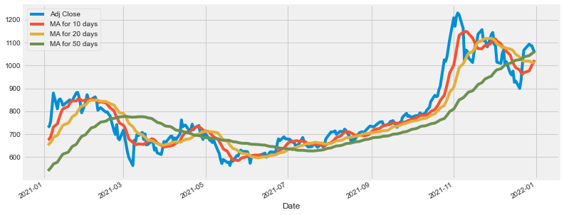
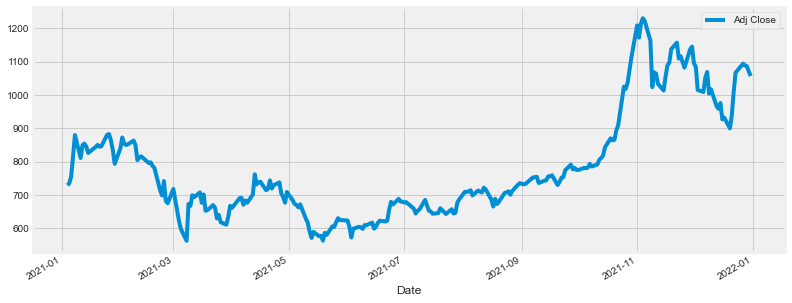
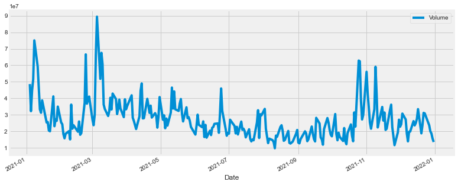

```python
import pandas as pd
import numpy as np

import matplotlib.pyplot as plt
import seaborn as sns
sns.set_style('whitegrid')
plt.style.use("fivethirtyeight")
%matplotlib inline

# For reading stock data from yahoo
from pandas_datareader.data import DataReader
import yfinance as yf

# For time stamps
from datetime import datetime
```


```python
pip install pandas_datareader
```

    Collecting pandas_datareader
      Downloading pandas_datareader-0.10.0-py3-none-any.whl (109 kB)
         |████████████████████████████████| 109 kB 3.9 MB/s eta 0:00:01
    [?25hRequirement already satisfied: requests>=2.19.0 in ./opt/anaconda3/lib/python3.9/site-packages (from pandas_datareader) (2.27.1)
    Requirement already satisfied: lxml in ./opt/anaconda3/lib/python3.9/site-packages (from pandas_datareader) (4.8.0)
    Requirement already satisfied: pandas>=0.23 in ./opt/anaconda3/lib/python3.9/site-packages (from pandas_datareader) (1.4.2)
    Requirement already satisfied: python-dateutil>=2.8.1 in ./opt/anaconda3/lib/python3.9/site-packages (from pandas>=0.23->pandas_datareader) (2.8.2)
    Requirement already satisfied: pytz>=2020.1 in ./opt/anaconda3/lib/python3.9/site-packages (from pandas>=0.23->pandas_datareader) (2021.3)
    Requirement already satisfied: numpy>=1.18.5 in ./opt/anaconda3/lib/python3.9/site-packages (from pandas>=0.23->pandas_datareader) (1.21.5)
    Requirement already satisfied: six>=1.5 in ./opt/anaconda3/lib/python3.9/site-packages (from python-dateutil>=2.8.1->pandas>=0.23->pandas_datareader) (1.16.0)
    Requirement already satisfied: urllib3<1.27,>=1.21.1 in ./opt/anaconda3/lib/python3.9/site-packages (from requests>=2.19.0->pandas_datareader) (1.26.9)
    Requirement already satisfied: charset-normalizer~=2.0.0 in ./opt/anaconda3/lib/python3.9/site-packages (from requests>=2.19.0->pandas_datareader) (2.0.4)
    Requirement already satisfied: certifi>=2017.4.17 in ./opt/anaconda3/lib/python3.9/site-packages (from requests>=2.19.0->pandas_datareader) (2021.10.8)
    Requirement already satisfied: idna<4,>=2.5 in ./opt/anaconda3/lib/python3.9/site-packages (from requests>=2.19.0->pandas_datareader) (3.3)
    Installing collected packages: pandas-datareader
    Successfully installed pandas-datareader-0.10.0
    Note: you may need to restart the kernel to use updated packages.


```python
pip install yfinance
```

    Collecting yfinance
      Downloading yfinance-0.1.70-py2.py3-none-any.whl (26 kB)
    Requirement already satisfied: lxml>=4.5.1 in ./opt/anaconda3/lib/python3.9/site-packages (from yfinance) (4.8.0)
    Requirement already satisfied: numpy>=1.15 in ./opt/anaconda3/lib/python3.9/site-packages (from yfinance) (1.21.5)
    Requirement already satisfied: requests>=2.26 in ./opt/anaconda3/lib/python3.9/site-packages (from yfinance) (2.27.1)
    Collecting multitasking>=0.0.7
      Downloading multitasking-0.0.10.tar.gz (8.2 kB)
    Requirement already satisfied: pandas>=0.24.0 in ./opt/anaconda3/lib/python3.9/site-packages (from yfinance) (1.4.2)
    Requirement already satisfied: python-dateutil>=2.8.1 in ./opt/anaconda3/lib/python3.9/site-packages (from pandas>=0.24.0->yfinance) (2.8.2)
    Requirement already satisfied: pytz>=2020.1 in ./opt/anaconda3/lib/python3.9/site-packages (from pandas>=0.24.0->yfinance) (2021.3)
    Requirement already satisfied: six>=1.5 in ./opt/anaconda3/lib/python3.9/site-packages (from python-dateutil>=2.8.1->pandas>=0.24.0->yfinance) (1.16.0)
    Requirement already satisfied: urllib3<1.27,>=1.21.1 in ./opt/anaconda3/lib/python3.9/site-packages (from requests>=2.26->yfinance) (1.26.9)
    Requirement already satisfied: certifi>=2017.4.17 in ./opt/anaconda3/lib/python3.9/site-packages (from requests>=2.26->yfinance) (2021.10.8)
    Requirement already satisfied: idna<4,>=2.5 in ./opt/anaconda3/lib/python3.9/site-packages (from requests>=2.26->yfinance) (3.3)
    Requirement already satisfied: charset-normalizer~=2.0.0 in ./opt/anaconda3/lib/python3.9/site-packages (from requests>=2.26->yfinance) (2.0.4)
    Building wheels for collected packages: multitasking
      Building wheel for multitasking (setup.py) ... [?25ldone
    [?25h  Created wheel for multitasking: filename=multitasking-0.0.10-py3-none-any.whl size=8500 sha256=5c58086b6afa7cd76061811ebbee5e671fd12d364925846562204185b26f3241
      Stored in directory: /Users/hymareddy/Library/Caches/pip/wheels/f2/b5/2c/59ba95dcf854e542944c75fe3da584e4e3833b319735a0546c
    Successfully built multitasking
    Installing collected packages: multitasking, yfinance
    Successfully installed multitasking-0.0.10 yfinance-0.1.70
    Note: you may need to restart the kernel to use updated packages.


```python
# Lets import yfinance as yf and create a ticker object for a Tesla stock.

import yfinance as yf

TSLA= yf.Ticker("TSLA")


TSLA
```


    yfinance.Ticker object <TSLA>


```python
# Lets pull daily stock prices for Tesla(TSLA)

data = yf.download("TSLA", start="2019-01-01", end="2022-04-30", interval="1d")

data
```

    [*********************100%***********************]  1 of 1 completed


<div>
<style scoped>
    .dataframe tbody tr th:only-of-type {
        vertical-align: middle;
    }

    .dataframe tbody tr th {
        vertical-align: top;
    }

    .dataframe thead th {
        text-align: right;
    }
</style>
<table border="1" class="dataframe">
  <thead>
    <tr style="text-align: right;">
      <th></th>
      <th>Open</th>
      <th>High</th>
      <th>Low</th>
      <th>Close</th>
      <th>Adj Close</th>
      <th>Volume</th>
    </tr>
    <tr>
      <th>Date</th>
      <th></th>
      <th></th>
      <th></th>
      <th></th>
      <th></th>
      <th></th>
    </tr>
  </thead>
  <tbody>
    <tr>
      <th>2018-12-31</th>
      <td>67.557999</td>
      <td>67.842003</td>
      <td>65.052002</td>
      <td>66.559998</td>
      <td>66.559998</td>
      <td>31511500</td>
    </tr>
    <tr>
      <th>2019-01-02</th>
      <td>61.220001</td>
      <td>63.026001</td>
      <td>59.759998</td>
      <td>62.023998</td>
      <td>62.023998</td>
      <td>58293000</td>
    </tr>
    <tr>
      <th>2019-01-03</th>
      <td>61.400002</td>
      <td>61.880001</td>
      <td>59.476002</td>
      <td>60.071999</td>
      <td>60.071999</td>
      <td>34826000</td>
    </tr>
    <tr>
      <th>2019-01-04</th>
      <td>61.200001</td>
      <td>63.599998</td>
      <td>60.546001</td>
      <td>63.537998</td>
      <td>63.537998</td>
      <td>36970500</td>
    </tr>
    <tr>
      <th>2019-01-07</th>
      <td>64.344002</td>
      <td>67.348000</td>
      <td>63.549999</td>
      <td>66.991997</td>
      <td>66.991997</td>
      <td>37756000</td>
    </tr>
    <tr>
      <th>...</th>
      <td>...</td>
      <td>...</td>
      <td>...</td>
      <td>...</td>
      <td>...</td>
      <td>...</td>
    </tr>
    <tr>
      <th>2022-04-22</th>
      <td>1014.909973</td>
      <td>1034.849976</td>
      <td>994.000000</td>
      <td>1005.049988</td>
      <td>1005.049988</td>
      <td>23232200</td>
    </tr>
    <tr>
      <th>2022-04-25</th>
      <td>978.969971</td>
      <td>1008.619995</td>
      <td>975.299988</td>
      <td>998.020020</td>
      <td>998.020020</td>
      <td>22780400</td>
    </tr>
    <tr>
      <th>2022-04-26</th>
      <td>995.429993</td>
      <td>1000.000000</td>
      <td>875.000000</td>
      <td>876.419983</td>
      <td>876.419983</td>
      <td>45377900</td>
    </tr>
    <tr>
      <th>2022-04-27</th>
      <td>898.580017</td>
      <td>918.000000</td>
      <td>877.359985</td>
      <td>881.510010</td>
      <td>881.510010</td>
      <td>25652100</td>
    </tr>
    <tr>
      <th>2022-04-28</th>
      <td>899.979980</td>
      <td>900.000000</td>
      <td>821.700012</td>
      <td>877.510010</td>
      <td>877.510010</td>
      <td>41649500</td>
    </tr>
  </tbody>
</table>
<p>839 rows × 6 columns</p>
</div>


```python
# Let's get price to earnings ratio

TSLA = yf.Ticker("TSLA")
TSLA.info['forwardPE']
```


    44.69836


```python
# Current volume

TSLA.info["volume"]
```


    28883854


```python
# Average volume over the last 24 hours:

TSLA.info["averageVolume"]
```


    26687481


```python
# Let's get the weekly highs and lows for Tesla

data = yf.download("TSLA", period="max", interval="1wk")

data

```

    [*********************100%***********************]  1 of 1 completed


<div>
<style scoped>
    .dataframe tbody tr th:only-of-type {
        vertical-align: middle;
    }

    .dataframe tbody tr th {
        vertical-align: top;
    }

    .dataframe thead th {
        text-align: right;
    }
</style>
<table border="1" class="dataframe">
  <thead>
    <tr style="text-align: right;">
      <th></th>
      <th>Open</th>
      <th>High</th>
      <th>Low</th>
      <th>Close</th>
      <th>Adj Close</th>
      <th>Volume</th>
    </tr>
    <tr>
      <th>Date</th>
      <th></th>
      <th></th>
      <th></th>
      <th></th>
      <th></th>
      <th></th>
    </tr>
  </thead>
  <tbody>
    <tr>
      <th>2010-06-28</th>
      <td>3.800000</td>
      <td>6.084000</td>
      <td>3.508000</td>
      <td>3.840000</td>
      <td>3.840000</td>
      <td>246560000.0</td>
    </tr>
    <tr>
      <th>2010-07-05</th>
      <td>4.000000</td>
      <td>4.000000</td>
      <td>2.996000</td>
      <td>3.480000</td>
      <td>3.480000</td>
      <td>127753000.0</td>
    </tr>
    <tr>
      <th>2010-07-12</th>
      <td>3.590000</td>
      <td>4.300000</td>
      <td>3.380000</td>
      <td>4.128000</td>
      <td>4.128000</td>
      <td>77194500.0</td>
    </tr>
    <tr>
      <th>2010-07-19</th>
      <td>4.274000</td>
      <td>4.450000</td>
      <td>3.900000</td>
      <td>4.258000</td>
      <td>4.258000</td>
      <td>35878500.0</td>
    </tr>
    <tr>
      <th>2010-07-26</th>
      <td>4.300000</td>
      <td>4.300000</td>
      <td>3.910000</td>
      <td>3.988000</td>
      <td>3.988000</td>
      <td>15260000.0</td>
    </tr>
    <tr>
      <th>...</th>
      <td>...</td>
      <td>...</td>
      <td>...</td>
      <td>...</td>
      <td>...</td>
      <td>...</td>
    </tr>
    <tr>
      <th>2022-04-25</th>
      <td>978.969971</td>
      <td>1008.619995</td>
      <td>821.700012</td>
      <td>870.760010</td>
      <td>870.760010</td>
      <td>164773300.0</td>
    </tr>
    <tr>
      <th>2022-05-02</th>
      <td>860.770020</td>
      <td>955.500000</td>
      <td>843.109985</td>
      <td>865.650024</td>
      <td>865.650024</td>
      <td>128815400.0</td>
    </tr>
    <tr>
      <th>2022-05-09</th>
      <td>836.450012</td>
      <td>845.630005</td>
      <td>680.000000</td>
      <td>769.590027</td>
      <td>769.590027</td>
      <td>168235000.0</td>
    </tr>
    <tr>
      <th>2022-05-16</th>
      <td>767.159973</td>
      <td>769.760010</td>
      <td>700.809998</td>
      <td>709.809998</td>
      <td>709.809998</td>
      <td>84558800.0</td>
    </tr>
    <tr>
      <th>2022-05-18</th>
      <td>744.520020</td>
      <td>760.500000</td>
      <td>700.809998</td>
      <td>709.809998</td>
      <td>709.809998</td>
      <td>28883854.0</td>
    </tr>
  </tbody>
</table>
<p>622 rows × 6 columns</p>
</div>


```python
# Lets plot an OHLC chart (Open, High, Low, Close prices) for Tesla stock.


import plotly.graph_objects as go

fig = go.Figure(
    data=go.Ohlc(
        x=data.index,
        open=data["Open"],
        high=data["High"],
        low=data["Low"],
        close=data["Close"],
     )
)

fig.update_layout(
     xaxis_title="OHLC chart with Tesla Stock prices"

)  


fig.show()


```


    ---------------------------------------------------------------------------

    NameError                                 Traceback (most recent call last)

    Input In [8], in <cell line: 23>()
          6 fig = go.Figure(
          7     data=go.Ohlc(
          8         x=data.index,
       (...)
         13      )
         14 )
         16 fig.update_layout(
         17      xaxis_title="OHLC chart with Tesla Stock prices"
         18 
         19 )  
    ---> 23 iplot(fig)


    NameError: name 'iplot' is not defined


```python
pip install --upgrade ta
```

    Collecting ta
      Downloading ta-0.10.1.tar.gz (24 kB)
    Requirement already satisfied: numpy in ./opt/anaconda3/lib/python3.9/site-packages (from ta) (1.21.5)
    Requirement already satisfied: pandas in ./opt/anaconda3/lib/python3.9/site-packages (from ta) (1.4.2)
    Requirement already satisfied: python-dateutil>=2.8.1 in ./opt/anaconda3/lib/python3.9/site-packages (from pandas->ta) (2.8.2)
    Requirement already satisfied: pytz>=2020.1 in ./opt/anaconda3/lib/python3.9/site-packages (from pandas->ta) (2021.3)
    Requirement already satisfied: six>=1.5 in ./opt/anaconda3/lib/python3.9/site-packages (from python-dateutil>=2.8.1->pandas->ta) (1.16.0)
    Building wheels for collected packages: ta
      Building wheel for ta (setup.py) ... [?25ldone
    [?25h  Created wheel for ta: filename=ta-0.10.1-py3-none-any.whl size=28986 sha256=7984f636de43a8f148d35636e2339bfcf84ace5c8ec34df3d11e2041599e9149
      Stored in directory: /Users/hymareddy/Library/Caches/pip/wheels/fa/f5/2a/22332fca050eb5e48116f8534cd267d50cffcd1e7581606150
    Successfully built ta
    Installing collected packages: ta
    Successfully installed ta-0.10.1
    Note: you may need to restart the kernel to use updated packages.


```python
#Let’s check out the moving average for stocks over a 10, 20 and 50 day period of time. We’ll add that information to the stock’s dataframe.


ma_day = [10,20,50]

for ma in ma_day:
    column_name = "MA for %s days" %(str(ma))
    data[column_name] = data['Adj Close'].rolling(window=ma,center=False).mean()

data.tail()
```


<div>
<style scoped>
    .dataframe tbody tr th:only-of-type {
        vertical-align: middle;
    }

    .dataframe tbody tr th {
        vertical-align: top;
    }

    .dataframe thead th {
        text-align: right;
    }
</style>
<table border="1" class="dataframe">
  <thead>
    <tr style="text-align: right;">
      <th></th>
      <th>Open</th>
      <th>High</th>
      <th>Low</th>
      <th>Close</th>
      <th>Adj Close</th>
      <th>Volume</th>
      <th>MA for 10 days</th>
      <th>MA for 20 days</th>
      <th>MA for 50 days</th>
    </tr>
    <tr>
      <th>Date</th>
      <th></th>
      <th></th>
      <th></th>
      <th></th>
      <th></th>
      <th></th>
      <th></th>
      <th></th>
      <th></th>
    </tr>
  </thead>
  <tbody>
    <tr>
      <th>2022-04-22</th>
      <td>1014.909973</td>
      <td>1034.849976</td>
      <td>994.000000</td>
      <td>1005.049988</td>
      <td>1005.049988</td>
      <td>23232200</td>
      <td>1001.921002</td>
      <td>1040.858493</td>
      <td>935.207194</td>
    </tr>
    <tr>
      <th>2022-04-25</th>
      <td>978.969971</td>
      <td>1008.619995</td>
      <td>975.299988</td>
      <td>998.020020</td>
      <td>998.020020</td>
      <td>22780400</td>
      <td>999.174005</td>
      <td>1040.227493</td>
      <td>937.076594</td>
    </tr>
    <tr>
      <th>2022-04-26</th>
      <td>995.429993</td>
      <td>1000.000000</td>
      <td>875.000000</td>
      <td>876.419983</td>
      <td>876.419983</td>
      <td>45377900</td>
      <td>989.223004</td>
      <td>1029.456494</td>
      <td>937.404994</td>
    </tr>
    <tr>
      <th>2022-04-27</th>
      <td>898.580017</td>
      <td>918.000000</td>
      <td>877.359985</td>
      <td>881.510010</td>
      <td>881.510010</td>
      <td>25652100</td>
      <td>978.679004</td>
      <td>1018.553497</td>
      <td>937.519994</td>
    </tr>
    <tr>
      <th>2022-04-28</th>
      <td>899.979980</td>
      <td>900.000000</td>
      <td>821.700012</td>
      <td>877.510010</td>
      <td>877.510010</td>
      <td>41649500</td>
      <td>964.193005</td>
      <td>1007.729498</td>
      <td>936.621594</td>
    </tr>
  </tbody>
</table>
</div>


```python
#Let’s plot the same, again using only last year i.e. 2021 data.


data.truncate(before='2021-01-01', after='2022-01-01')[['Adj Close','MA for 10 days','MA for 20 days','MA for 50 days']].plot(subplots=False,figsize=(12,5))
```


    <AxesSubplot:xlabel='Date'>


    

    


```python
# Plotting the stock's adjusted closing price using pandas


data.truncate(before='2021-01-01', after='2022-01-01')['Adj Close'].plot(legend=True,figsize=(12,5))
```


    <AxesSubplot:xlabel='Date'>


    

    


```python
# Plotting the total volume being traded over time

data.truncate(before='2021-01-01', after='2022-01-01')['Volume'].plot(legend=True,figsize=(12,5))
```


    <AxesSubplot:xlabel='Date'>


    

    


```python

```


```python

```
