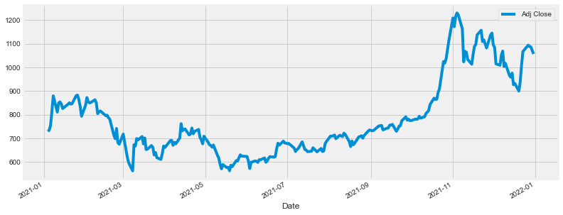
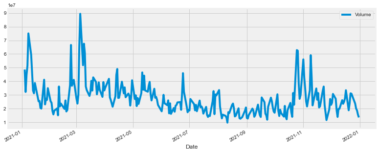

```python
import pandas as pd
import numpy as np

import matplotlib.pyplot as plt
import seaborn as sns
sns.set_style('whitegrid')
plt.style.use("fivethirtyeight")
%matplotlib inline

# For reading stock data from yahoo
from pandas_datareader.data import DataReader
import yfinance as yf

# For time stamps
from datetime import datetime
```


```python
# Lets import yfinance as yf and create a ticker object for a Tesla stock.

import yfinance as yf

TSLA= yf.Ticker("TSLA")


TSLA
```


    yfinance.Ticker object <TSLA>


```python
# Lets pull daily stock prices for Tesla(TSLA)

data = yf.download("TSLA", start="2019-01-01", end="2022-04-30", interval="1d")

data
```

    [*********************100%***********************]  1 of 1 completed


<div>
<style scoped>
    .dataframe tbody tr th:only-of-type {
        vertical-align: middle;
    }

    .dataframe tbody tr th {
        vertical-align: top;
    }

    .dataframe thead th {
        text-align: right;
    }
</style>
<table border="1" class="dataframe">
  <thead>
    <tr style="text-align: right;">
      <th></th>
      <th>Open</th>
      <th>High</th>
      <th>Low</th>
      <th>Close</th>
      <th>Adj Close</th>
      <th>Volume</th>
    </tr>
    <tr>
      <th>Date</th>
      <th></th>
      <th></th>
      <th></th>
      <th></th>
      <th></th>
      <th></th>
    </tr>
  </thead>
  <tbody>
    <tr>
      <th>2018-12-31</th>
      <td>67.557999</td>
      <td>67.842003</td>
      <td>65.052002</td>
      <td>66.559998</td>
      <td>66.559998</td>
      <td>31511500</td>
    </tr>
    <tr>
      <th>2019-01-02</th>
      <td>61.220001</td>
      <td>63.026001</td>
      <td>59.759998</td>
      <td>62.023998</td>
      <td>62.023998</td>
      <td>58293000</td>
    </tr>
    <tr>
      <th>2019-01-03</th>
      <td>61.400002</td>
      <td>61.880001</td>
      <td>59.476002</td>
      <td>60.071999</td>
      <td>60.071999</td>
      <td>34826000</td>
    </tr>
    <tr>
      <th>2019-01-04</th>
      <td>61.200001</td>
      <td>63.599998</td>
      <td>60.546001</td>
      <td>63.537998</td>
      <td>63.537998</td>
      <td>36970500</td>
    </tr>
    <tr>
      <th>2019-01-07</th>
      <td>64.344002</td>
      <td>67.348000</td>
      <td>63.549999</td>
      <td>66.991997</td>
      <td>66.991997</td>
      <td>37756000</td>
    </tr>
    <tr>
      <th>...</th>
      <td>...</td>
      <td>...</td>
      <td>...</td>
      <td>...</td>
      <td>...</td>
      <td>...</td>
    </tr>
    <tr>
      <th>2022-04-22</th>
      <td>1014.909973</td>
      <td>1034.849976</td>
      <td>994.000000</td>
      <td>1005.049988</td>
      <td>1005.049988</td>
      <td>23232200</td>
    </tr>
    <tr>
      <th>2022-04-25</th>
      <td>978.969971</td>
      <td>1008.619995</td>
      <td>975.299988</td>
      <td>998.020020</td>
      <td>998.020020</td>
      <td>22780400</td>
    </tr>
    <tr>
      <th>2022-04-26</th>
      <td>995.429993</td>
      <td>1000.000000</td>
      <td>875.000000</td>
      <td>876.419983</td>
      <td>876.419983</td>
      <td>45377900</td>
    </tr>
    <tr>
      <th>2022-04-27</th>
      <td>898.580017</td>
      <td>918.000000</td>
      <td>877.359985</td>
      <td>881.510010</td>
      <td>881.510010</td>
      <td>25652100</td>
    </tr>
    <tr>
      <th>2022-04-28</th>
      <td>899.979980</td>
      <td>900.000000</td>
      <td>821.700012</td>
      <td>877.510010</td>
      <td>877.510010</td>
      <td>41649500</td>
    </tr>
  </tbody>
</table>
<p>839 rows × 6 columns</p>
</div>


```python
# Let's get price to earnings ratio

TSLA = yf.Ticker("TSLA")
TSLA.info['forwardPE']
```


    44.69836


```python
# Current volume

TSLA.info["volume"]
```


    28883854


```python
# Average volume over the last 24 hours:

TSLA.info["averageVolume"]
```


    26687481


```python
# Let's get the weekly highs and lows for Tesla

data = yf.download("TSLA", period="max", interval="1wk")

data

```

    [*********************100%***********************]  1 of 1 completed


<div>
<style scoped>
    .dataframe tbody tr th:only-of-type {
        vertical-align: middle;
    }

    .dataframe tbody tr th {
        vertical-align: top;
    }

    .dataframe thead th {
        text-align: right;
    }
</style>
<table border="1" class="dataframe">
  <thead>
    <tr style="text-align: right;">
      <th></th>
      <th>Open</th>
      <th>High</th>
      <th>Low</th>
      <th>Close</th>
      <th>Adj Close</th>
      <th>Volume</th>
    </tr>
    <tr>
      <th>Date</th>
      <th></th>
      <th></th>
      <th></th>
      <th></th>
      <th></th>
      <th></th>
    </tr>
  </thead>
  <tbody>
    <tr>
      <th>2010-06-28</th>
      <td>3.800000</td>
      <td>6.084000</td>
      <td>3.508000</td>
      <td>3.840000</td>
      <td>3.840000</td>
      <td>246560000.0</td>
    </tr>
    <tr>
      <th>2010-07-05</th>
      <td>4.000000</td>
      <td>4.000000</td>
      <td>2.996000</td>
      <td>3.480000</td>
      <td>3.480000</td>
      <td>127753000.0</td>
    </tr>
    <tr>
      <th>2010-07-12</th>
      <td>3.590000</td>
      <td>4.300000</td>
      <td>3.380000</td>
      <td>4.128000</td>
      <td>4.128000</td>
      <td>77194500.0</td>
    </tr>
    <tr>
      <th>2010-07-19</th>
      <td>4.274000</td>
      <td>4.450000</td>
      <td>3.900000</td>
      <td>4.258000</td>
      <td>4.258000</td>
      <td>35878500.0</td>
    </tr>
    <tr>
      <th>2010-07-26</th>
      <td>4.300000</td>
      <td>4.300000</td>
      <td>3.910000</td>
      <td>3.988000</td>
      <td>3.988000</td>
      <td>15260000.0</td>
    </tr>
    <tr>
      <th>...</th>
      <td>...</td>
      <td>...</td>
      <td>...</td>
      <td>...</td>
      <td>...</td>
      <td>...</td>
    </tr>
    <tr>
      <th>2022-04-25</th>
      <td>978.969971</td>
      <td>1008.619995</td>
      <td>821.700012</td>
      <td>870.760010</td>
      <td>870.760010</td>
      <td>164773300.0</td>
    </tr>
    <tr>
      <th>2022-05-02</th>
      <td>860.770020</td>
      <td>955.500000</td>
      <td>843.109985</td>
      <td>865.650024</td>
      <td>865.650024</td>
      <td>128815400.0</td>
    </tr>
    <tr>
      <th>2022-05-09</th>
      <td>836.450012</td>
      <td>845.630005</td>
      <td>680.000000</td>
      <td>769.590027</td>
      <td>769.590027</td>
      <td>168235000.0</td>
    </tr>
    <tr>
      <th>2022-05-16</th>
      <td>767.159973</td>
      <td>769.760010</td>
      <td>700.809998</td>
      <td>709.809998</td>
      <td>709.809998</td>
      <td>84558800.0</td>
    </tr>
    <tr>
      <th>2022-05-18</th>
      <td>744.520020</td>
      <td>760.500000</td>
      <td>700.809998</td>
      <td>709.809998</td>
      <td>709.809998</td>
      <td>28883854.0</td>
    </tr>
  </tbody>
</table>
<p>622 rows × 6 columns</p>
</div>


```python
# Lets plot an OHLC chart (Open, High, Low, Close prices) for Tesla stock.


import plotly.graph_objects as go

fig = go.Figure(
    data=go.Ohlc(
        x=data.index,
        open=data["Open"],
        high=data["High"],
        low=data["Low"],
        close=data["Close"],
     )
)

fig.update_layout(
     xaxis_title="OHLC chart with Tesla Stock prices"

)  


fig.show()


```


<div>                            <div id="188fd961-bc8a-4338-b4fd-1431227f6640" class="plotly-graph-div" style="height:525px; width:100%;"></div>            <script type="text/javascript">                require(["plotly"], function(Plotly) {                    window.PLOTLYENV=window.PLOTLYENV || {};                                    if (document.getElementById("188fd961-bc8a-4338-b4fd-1431227f6640")) {                    Plotly.newPlot(                        "188fd961-bc8a-4338-b4fd-1431227f6640",                        [{"close":[3.8399999141693115,3.4800000190734863,4.127999782562256,4.257999897003174,3.98799991607666,3.9179999828338623,3.6640000343322754,3.819999933242798,3.940000057220459,4.210000038146973,4.033999919891357,4.046000003814697,4.019999980926514,4.119999885559082,4.085999965667725,4.107999801635742,4.144000053405762,4.368000030517578,4.888000011444092,5.9679999351501465,6.197999954223633,7.064000129699707,6.297999858856201,6.303999900817871,6.271999835968018,6.01800012588501,5.326000213623047,5.6479997634887695,5.150000095367432,4.607999801635742,4.802000045776367,4.691999912261963,4.650000095367432,4.636000156402588,4.7220001220703125,4.989999771118164,4.814000129699707,4.5920000076293945,4.550000190734863,5.331999778747559,5.297999858856201,5.116000175476074,5.3480000495910645,5.519999980926514,5.423999786376953,5.510000228881836,5.593999862670898,5.909999847412109,6.026000022888184,5.572000026702881,5.300000190734863,5.513999938964844,5.803999900817871,5.76200008392334,5.515999794006348,5.857999801635742,5.633999824523926,4.8480000495910645,5.26200008392334,4.460000038146973,4.745999813079834,4.613999843597412,4.593999862670898,5.159999847412109,5.276000022888184,4.877999782562256,5.3979997634887695,5.610000133514404,5.605999946594238,5.973999977111816,6.461999893188477,6.728000164031982,6.519999980926514,6.331999778747559,6.659999847412109,6.208000183105469,5.599999904632568,5.579999923706055,5.711999893188477,5.381999969482422,4.558000087738037,5.320000171661377,5.866000175476074,6.230000019073486,6.21999979019165,6.99399995803833,6.75,6.808000087738037,6.947999954223633,7.064000129699707,6.815999984741211,7.447999954223633,6.895999908447266,6.7179999351501465,6.631999969482422,6.668000221252441,6.366000175476074,6.449999809265137,5.51200008392334,5.961999893188477,5.630000114440918,6.015999794006348,5.98199987411499,6.757999897003174,6.257999897003174,6.197999954223633,6.849999904632568,6.357999801635742,5.9019999504089355,5.453999996185303,5.98799991607666,6.001999855041504,5.900000095367432,5.703999996185303,5.869999885559082,6.078000068664551,6.004000186920166,5.855999946594238,5.7779998779296875,5.5279998779296875,5.547999858856201,5.47599983215332,5.783999919891357,6.064000129699707,6.368000030517578,6.426000118255615,6.763999938964844,6.834000110626221,6.76200008392334,6.800000190734863,6.644000053405762,6.880000114440918,6.581999778747559,6.9039998054504395,7.395999908447266,7.659999847412109,7.8480000495910645,7.4079999923706055,7.2220001220703125,6.929999828338623,7.693999767303467,7.058000087738037,7.323999881744385,7.578000068664551,8.27400016784668,8.75,9.565999984741211,10.239999771118164,10.90999984741211,15.35200023651123,18.299999237060547,19.416000366210938,19.552000045776367,20.408000946044922,20.059999465942383,19.90999984741211,21.472000122070312,24.01799964904785,25.979999542236328,23.93600082397461,25.878000259399414,27.600000381469727,30.600000381469727,28.399999618530273,32.36800003051758,33.79999923706055,33.39400100708008,33.108001708984375,36.678001403808594,38.18000030517578,36.19599914550781,35.7400016784668,36.68000030517578,33.93199920654297,32.433998107910156,27.59000015258789,27.09000015258789,24.275999069213867,25.45599937438965,27.472000122070312,29.530000686645508,28.648000717163086,30.224000930786133,29.91200065612793,29.143999099731445,34.00199890136719,34.91999816894531,36.28200149536133,37.305999755859375,39.645999908447266,41.91999816894531,48.96200180053711,49.242000579833984,46.194000244140625,45.77799987792969,42.4739990234375,42.44599914550781,40.75600051879883,39.624000549316406,39.970001220703125,42.18199920654297,36.45199966430664,38.3120002746582,41.459999084472656,41.55400085449219,41.63399887084961,41.284000396728516,45.917999267578125,47.8120002746582,45.849998474121094,43.625999450683594,44.00400161743164,44.7140007019043,46.65399932861328,49.625999450683594,52.402000427246094,51.35599899291992,53.939998626708984,55.47800064086914,55.84000015258789,51.86399841308594,49.31999969482422,51.04199981689453,47.38199996948242,45.49599838256836,47.04800033569336,48.34000015258789,48.040000915527344,51.736000061035156,48.555999755859375,48.90399932861328,44.742000579833984,41.400001525878906,43.858001708984375,45.56399917602539,43.86199951171875,41.332000732421875,38.61399841308594,40.257999420166016,40.720001220703125,43.47200012207031,40.75400161743164,43.422000885009766,40.667999267578125,38.7760009765625,37.736000061035156,39.61600112915039,37.0,38.20000076293945,42.18000030517578,41.358001708984375,43.68600082397461,45.20600128173828,47.321998596191406,49.768001556396484,49.54600143432617,50.15999984741211,49.827999114990234,50.13800048828125,52.50199890136719,53.417999267578125,56.00400161743164,51.83000183105469,54.93199920654297,53.082000732421875,53.22999954223633,48.50199890136719,48.630001068115234,46.15399932861328,49.69599914550781,48.38600158691406,50.04800033569336,52.124000549316406,51.38199996948242,49.513999938964844,44.13800048828125,45.402000427246094,41.81800079345703,41.38600158691406,46.47200012207031,41.4379997253418,44.00199890136719,46.321998596191406,46.07600021362305,43.40399932861328,46.09199905395508,46.11399841308594,48.00199890136719,42.20000076293945,40.99800109863281,40.5099983215332,38.2400016784668,32.52000045776367,30.20800018310547,33.316001892089844,38.06800079345703,40.20800018310547,41.5,46.54800033569336,45.54999923706055,47.518001556396484,50.013999938964844,50.902000427246094,50.75,48.152000427246094,42.986000061035156,41.52199935913086,44.055999755859375,44.608001708984375,43.79800033569336,43.757999420166016,43.09400177001953,38.630001068115234,43.29999923706055,43.35599899291992,44.08000183105469,44.45399856567383,46.95800018310547,46.00600051879883,45.12200164794922,45.0,43.99800109863281,39.555999755859375,38.89400100708008,41.08000183105469,41.4900016784668,40.805999755859375,39.321998596191406,39.301998138427734,40.018001556396484,39.99399948120117,38.11199951171875,37.71200180053711,37.00400161743164,39.33000183105469,36.29399871826172,38.43600082397461,40.49800109863281,42.667999267578125,42.737998962402344,45.801998138427734,47.54999923706055,48.94599914550781,50.59000015258789,50.26599884033203,53.84600067138672,54.44599914550781,51.400001525878906,50.31399917602539,48.737998962402344,52.29999923706055,52.63199996948242,55.65999984741211,60.507999420166016,60.79999923706055,61.119998931884766,62.81399917602539,61.66999816894531,64.96199798583984,62.16600036621094,65.02799987792969,67.97000122070312,71.46399688720703,74.27999877929688,76.69000244140625,72.3219985961914,62.64400100708008,65.55599975585938,65.68000030517578,67.01399993896484,71.38200378417969,71.5739974975586,69.49199676513672,69.61000061035156,71.08000183105469,68.68000030517578,75.96199798583984,70.21800231933594,68.22000122070312,71.3759994506836,71.11399841308594,69.0199966430664,64.17400360107422,61.21799850463867,60.597999572753906,63.0099983215332,63.11000061035156,61.305999755859375,63.0260009765625,68.69000244140625,65.04000091552734,62.27000045776367,63.316001892089844,67.24400329589844,70.00399780273438,68.56999969482422,68.75,62.08399963378906,67.0979995727539,70.41000366210938,67.02400207519531,65.43399810791016,64.2699966430664,60.30799865722656,53.22600173950195,59.86000061035156,60.06800079345703,58.04800033569336,58.816001892089844,58.81800079345703,60.21200180053711,55.36399841308594,55.77000045776367,58.36399841308594,63.53200149536133,71.63400268554688,66.72599792480469,68.58999633789062,61.779998779296875,63.77399826049805,62.715999603271484,59.43600082397461,69.63400268554688,71.0979995727539,61.099998474121094,64.56400299072266,60.332000732421875,52.64799880981445,59.040000915527344,59.81999969482422,52.95399856567383,52.38999938964844,51.75600051879883,52.0,66.18000030517578,69.28199768066406,70.10199737548828,70.86199951171875,65.16600036621094,70.09600067138672,71.59400177001953,73.14199829101562,63.95399856567383,66.77400207519531,63.53799819946289,69.4520034790039,60.45199966430664,59.40800094604492,62.44200134277344,61.15999984741211,61.57600021362305,58.94200134277344,58.95800018310547,56.827999114990234,55.08599853515625,52.90599822998047,55.97200012207031,54.992000579833984,53.540000915527344,54.652000427246094,47.02799987792969,51.00600051879883,47.90399932861328,42.20600128173828,38.125999450683594,37.03200149536133,40.900001525878906,42.98400115966797,44.37200164794922,44.69200134277344,46.619998931884766,49.01599884033203,51.63600158691406,45.608001708984375,46.86800003051758,47.00199890136719,43.987998962402344,42.279998779296875,45.12200164794922,45.4900016784668,49.040000915527344,48.124000549316406,48.42599868774414,46.2859992980957,49.577999114990234,51.38999938964844,65.6259994506836,62.6619987487793,67.4280014038086,70.43399810791016,66.60800170898438,65.98799896240234,67.1780014038086,71.6780014038086,81.11799621582031,86.07599639892578,88.60199737548828,95.62999725341797,102.0999984741211,112.96399688720703,130.11399841308594,149.61399841308594,160.00599670410156,180.1999969482422,133.59800720214844,140.6959991455078,109.3239974975586,85.50599670410156,102.87200164794922,96.00199890136719,114.5999984741211,150.7779998779297,145.02999877929688,140.26400756835938,163.88400268554688,159.83399963378906,163.37600708007812,167.0,177.1320037841797,187.05599975585938,200.17999267578125,191.947998046875,241.73199462890625,308.92999267578125,300.1679992675781,283.3999938964844,286.1520080566406,290.5419921875,330.1419982910156,409.9960021972656,442.67999267578125,418.32000732421875,372.7200012207031,442.1499938964844,407.3399963378906,415.0899963378906,434.0,439.6700134277344,420.6300048828125,388.0400085449219,429.95001220703125,408.5,489.6099853515625,585.760009765625,599.0399780273438,609.989990234375,695.0,661.77001953125,705.6699829101562,880.02001953125,826.1599731445312,846.6400146484375,793.530029296875,852.22998046875,816.1199951171875,781.2999877929688,675.5,597.9500122070312,693.72998046875,654.8699951171875,618.7100219726562,661.75,677.02001953125,739.780029296875,729.4000244140625,709.4400024414062,672.3699951171875,589.739990234375,580.8800048828125,625.219970703125,599.0499877929688,609.8900146484375,623.3099975585938,671.8699951171875,678.9000244140625,656.9500122070312,644.219970703125,643.3800048828125,687.2000122070312,699.0999755859375,717.1699829101562,680.260009765625,711.9199829101562,733.5700073242188,736.27001953125,759.489990234375,774.3900146484375,775.219970703125,785.489990234375,843.030029296875,909.6799926757812,1114.0,1222.0899658203125,1033.4200439453125,1137.06005859375,1081.9200439453125,1014.969970703125,1017.030029296875,932.5700073242188,1067.0,1056.780029296875,1026.9599609375,1049.6099853515625,943.9000244140625,846.3499755859375,923.3200073242188,860.0,856.97998046875,809.8699951171875,838.2899780273438,795.3499755859375,905.3900146484375,1010.6400146484375,1084.5899658203125,1025.489990234375,985.0,1005.0499877929688,870.760009765625,865.6500244140625,769.5900268554688,709.8099975585938,709.8099975585938],"high":[6.084000110626221,4.0,4.300000190734863,4.449999809265137,4.300000190734863,4.435999870300293,3.996000051498413,3.9179999828338623,4.078000068664551,4.260000228881836,4.210000038146973,4.631999969482422,4.309999942779541,4.429999828338623,4.25600004196167,4.205999851226807,4.190000057220459,4.374000072479248,5.065999984741211,6.099999904632568,6.5879998207092285,7.199999809265137,7.283999919891357,6.584000110626221,6.354000091552734,6.572000026702881,5.716000080108643,5.716000080108643,5.742000102996826,5.127999782562256,5.015999794006348,4.946000099182129,5.050000190734863,5.0980000495910645,4.769999980926514,4.998000144958496,5.079999923706055,4.800000190734863,4.610000133514404,5.742000102996826,5.5879998207092285,5.306000232696533,5.395999908447266,5.573999881744385,5.559999942779541,5.789999961853027,5.688000202178955,5.952000141143799,6.300000190734863,6.026000022888184,5.940000057220459,5.650000095367432,5.920000076293945,6.0,5.817999839782715,6.0879998207092285,5.849999904632568,5.840000152587891,5.427999973297119,5.349999904632568,4.789999961853027,5.099999904632568,4.806000232696533,5.168000221252441,5.389999866485596,5.3979997634887695,5.519999980926514,5.710000038146973,5.685999870300293,6.0,6.498000144958496,6.900000095367432,7.0,6.558000087738037,6.797999858856201,7.0,6.185999870300293,5.699999809265137,5.868000030517578,5.900000095367432,5.723999977111816,5.547999858856201,5.943999767303467,6.265999794006348,6.579999923706055,6.99399995803833,6.99399995803833,6.900000095367432,7.061999797821045,7.317999839782715,7.064000129699707,7.989999771118164,7.693999767303467,6.895999908447266,6.745999813079834,6.72599983215332,6.877999782562256,6.935999870300293,6.426000118255615,6.26800012588501,6.386000156402588,6.038000106811523,6.199999809265137,6.900000095367432,6.823999881744385,6.360000133514404,6.880000114440918,7.199999809265137,6.260000228881836,6.050000190734863,6.179999828338623,6.260000228881836,6.170000076293945,5.940000057220459,5.914000034332275,6.130000114440918,6.556000232696533,6.205999851226807,6.019999980926514,5.880000114440918,5.797999858856201,5.711999893188477,5.909999847412109,6.409999847412109,6.423999786376953,6.693999767303467,6.857999801635742,7.0,7.159999847412109,7.052000045776367,6.900000095367432,7.090000152587891,6.960000038146973,6.96999979019165,7.544000148773193,7.742000102996826,8.0,7.829999923706055,7.929999828338623,7.349999904632568,7.888000011444092,7.8979997634887695,7.4120001792907715,7.703999996185303,9.336000442504883,9.027999877929688,9.97599983215332,10.748000144958496,11.63599967956543,16.200000762939453,19.423999786376953,19.59000015258789,22.979999542236328,20.579999923706055,20.503999710083008,21.426000595092773,22.049999237060547,24.378000259399414,25.988000869750977,26.652000427246094,26.13599967956543,27.649999618530273,31.775999069213867,30.100000381469727,32.459999084472656,34.599998474121094,34.7400016784668,33.58000183105469,37.16600036621094,38.25600051879883,38.900001525878906,37.34600067138672,37.757999420166016,36.678001403808594,34.099998474121094,36.2859992980957,29.083999633789062,27.09000015258789,26.118000030517578,28.988000869750977,30.360000610351562,30.979999542236328,31.600000381469727,30.961999893188477,30.739999771118164,34.63999938964844,36.47600173950195,37.20000076293945,37.32600021362305,40.54399871826172,43.04199981689453,53.0,52.0,49.5,48.310001373291016,45.97999954223633,47.145999908447266,43.689998626708984,41.6879997253418,43.86600112915039,42.80400085449219,43.731998443603516,38.69599914550781,41.551998138427734,42.959999084472656,42.1619987487793,41.99800109863281,47.108001708984375,48.375999450683594,48.89799880981445,45.95600128173828,45.757999420166016,45.39400100708008,47.5,51.3380012512207,53.12799835205078,53.45199966430664,54.400001525878906,58.284000396728516,57.097999572753906,54.880001068115234,51.20399856567383,51.29999923706055,53.108001708984375,47.79199981689453,47.560001373291016,48.91999816894531,49.512001037597656,51.77000045776367,51.99800109863281,49.944000244140625,48.49399948120117,44.97200012207031,44.08000183105469,45.70000076293945,45.582000732421875,43.29999923706055,41.52199935913086,40.70000076293945,41.7239990234375,45.09600067138672,44.099998474121094,43.52000045776367,43.63999938964844,41.237998962402344,39.236000061035156,40.917999267578125,40.757999420166016,38.75199890136719,42.33000183105469,42.599998474121094,44.375999450683594,47.75,47.900001525878906,49.880001068115234,50.20000076293945,50.57400131225586,50.31999969482422,51.75,52.87200164794922,54.28200149536133,56.4900016784668,56.3380012512207,55.108001708984375,57.33000183105469,53.87200164794922,54.20000076293945,49.58599853515625,52.189998626708984,50.290000915527344,50.9900016784668,50.849998474121094,53.099998474121094,54.31399917602539,51.95800018310547,49.96799850463867,46.09600067138672,46.22999954223633,43.41999816894531,46.91600036621094,46.597999572753906,45.237998962402344,46.45000076293945,47.720001220703125,47.125999450683594,47.551998138427734,47.310001373291016,48.72600173950195,46.2760009765625,42.88999938964844,42.09400177001953,40.7140007019043,39.90399932861328,32.652000427246094,34.59000015258789,38.400001525878906,40.805999755859375,42.65800094604492,46.895999908447266,47.97600173950195,49.58000183105469,53.86800003051758,51.79800033569336,51.6619987487793,51.47600173950195,48.63800048828125,43.22999954223633,44.11000061035156,45.18600082397461,44.95000076293945,48.16999816894531,45.15399932861328,44.75,43.64799880981445,43.96200180053711,45.5,45.959999084472656,47.055999755859375,47.32600021362305,46.30799865722656,45.900001525878906,45.698001861572266,44.08000183105469,41.29999923706055,41.13999938964844,42.0359992980957,42.20000076293945,43.13399887084961,40.827999114990234,41.332000732421875,42.7400016784668,40.49800109863281,39.49800109863281,38.599998474121094,39.448001861572266,39.869998931884766,38.768001556396484,40.599998474121094,42.689998626708984,44.7599983215332,46.0620002746582,47.56999969482422,49.736000061035156,51.69200134277344,51.178001403808594,54.236000061035156,57.47800064086914,56.689998626708984,50.970001220703125,50.77799987792969,53.150001525878906,52.959999084472656,56.400001525878906,60.97600173950195,62.74599838256836,61.83000183105469,62.959999084472656,65.53199768066406,65.4000015258789,64.04000091552734,65.0979995727539,68.97599792480469,75.3740005493164,76.8499984741211,77.39800262451172,77.38999938964844,74.2699966430664,66.62000274658203,66.33000183105469,69.5,71.4540023803711,74.0,73.53199768066406,71.33200073242188,71.68800354003906,71.0979995727539,76.0,77.9219970703125,71.49400329589844,72.0199966430664,71.95600128173828,72.5999984741211,69.98999786376953,66.52200317382812,61.672000885009766,65.33399963378906,63.645999908447266,64.0,63.72600173950195,69.48799896240234,69.34600067138672,64.78800201416016,65.05000305175781,68.96199798583984,70.45999908447266,72.0999984741211,71.93199920654297,69.7239990234375,68.6240005493164,70.99800109863281,71.99800109863281,67.55000305175781,69.44200134277344,64.48799896240234,61.518001556396484,61.85599899291992,61.900001525878906,60.20199966430664,58.89400100708008,61.369998931884766,62.597999572753906,60.987998962402344,58.29800033569336,59.00199890136719,66.0,72.93399810791016,74.74600219726562,71.40399932861328,72.95600128173828,65.53600311279297,65.0999984741211,62.13999938964844,71.0,77.49199676513672,72.63800048828125,65.46399688720703,64.48799896240234,59.63800048828125,59.465999603271484,61.19599914550781,62.992000579833984,63.36800003051758,53.551998138427734,56.540000915527344,67.9800033569336,69.83999633789062,71.51599884033203,71.13999938964844,73.3499984741211,70.31999969482422,75.89800262451172,75.5739974975586,73.13999938964844,67.24800109863281,67.84200286865234,69.68199920654297,70.4000015258789,61.599998474121094,63.220001220703125,64.8479995727539,63.720001220703125,62.30799865722656,64.0,59.79999923706055,59.077999114990234,55.61000061035156,56.066001892089844,59.23400115966797,56.231998443603516,55.0,53.93600082397461,51.321998596191406,51.66999816894531,46.900001525878906,41.47999954223633,39.0,42.20000076293945,44.67599868774414,46.948001861572266,45.44599914550781,48.31399917602539,49.07600021362305,51.992000579833984,53.2140007019043,49.33599853515625,47.959999084472656,47.20000076293945,45.81800079345703,46.487998962402344,45.959999084472656,50.70000076293945,49.63399887084961,49.742000579833984,49.189998626708984,50.215999603271484,52.95600128173828,66.0,68.16799926757812,68.30000305175781,71.26599884033203,72.23999786376953,68.91400146484375,67.77200317382812,73.04199981689453,82.5999984741211,87.06199645996094,90.80000305175781,99.76000213623047,109.48200225830078,118.9000015258789,130.60000610351562,193.79800415039062,163.9980010986328,188.95599365234375,172.6999969482422,161.39599609375,133.60000610351562,98.9739990234375,112.0,108.59200286865234,115.03600311279297,154.99000549316406,153.11399841308594,173.96400451660156,164.8000030517578,168.6580047607422,166.94400024414062,167.0,181.73199462890625,205.49600219726562,203.83999633789062,202.39999389648438,245.60000610351562,309.78399658203125,358.99798583984375,337.79998779296875,312.94000244140625,305.48199462890625,333.760009765625,419.0979919433594,463.697998046875,502.489990234375,398.989990234375,461.94000244140625,455.67999267578125,448.8800048828125,439.0,465.8999938964844,447.0,430.5,440.0,452.5,508.6099853515625,598.780029296875,607.7999877929688,654.3200073242188,695.0,668.5,718.719970703125,884.489990234375,868.0,859.5,900.4000244140625,880.5,877.77001953125,821.0,768.5,721.1099853515625,717.8499755859375,713.1799926757812,699.6199951171875,692.4199829101562,708.1599731445312,780.7899780273438,753.77001953125,749.2999877929688,706.0,665.0499877929688,596.6799926757812,635.5900268554688,633.7999877929688,623.0900268554688,628.3499755859375,697.6199951171875,700.0,684.0,693.280029296875,664.8599853515625,697.530029296875,726.9400024414062,729.9000244140625,709.5,716.969970703125,741.989990234375,764.4500122070312,761.0399780273438,774.7999877929688,799.0,806.969970703125,843.2100219726562,910.0,1115.2099609375,1243.489990234375,1197.0,1138.719970703125,1201.949951171875,1172.8399658203125,1072.3800048828125,1005.0,1072.97998046875,1119.0,1208.0,1115.5999755859375,1070.7900390625,987.6900024414062,943.7000122070312,947.77001953125,926.4299926757812,856.72998046875,889.8800048828125,866.1400146484375,907.8499755859375,1040.699951171875,1114.77001953125,1152.8699951171875,1026.239990234375,1092.219970703125,1008.6199951171875,955.5,845.6300048828125,769.760009765625,760.5],"low":[3.507999897003174,2.996000051498413,3.380000114440918,3.9000000953674316,3.9100000858306885,3.9040000438690186,3.4779999256134033,3.6519999504089355,3.7119998931884766,3.865999937057495,3.9519999027252197,3.9600000381469727,3.9000000953674316,4.010000228881836,4.059999942779541,4.00600004196167,4.0,4.1020002365112305,4.210000038146973,4.806000232696533,5.684000015258789,6.300000190734863,6.173999786376953,5.9120001792907715,5.552000045776367,5.984000205993652,5.0,5.179999828338623,5.122000217437744,4.473999977111816,4.645999908447266,4.630000114440918,4.558000087738037,4.51200008392334,4.2220001220703125,4.699999809265137,4.705999851226807,4.360000133514404,4.354000091552734,4.510000228881836,5.046000003814697,4.840000152587891,4.872000217437744,5.193999767303467,5.150000095367432,5.329999923706055,5.104000091552734,5.234000205993652,5.676000118255615,5.4039998054504395,5.1479997634887695,5.099999904632568,5.461999893188477,5.710000038146973,5.449999809265137,5.326000213623047,5.5,4.565999984741211,4.619999885559082,4.400000095367432,4.300000190734863,4.535999774932861,4.458000183105469,4.489999771118164,4.763999938964844,4.697999954223633,4.585999965667725,5.400000095367432,5.3420000076293945,5.480000019073486,5.599999904632568,6.059999942779541,6.507999897003174,6.210000038146973,6.326000213623047,5.921999931335449,5.5960001945495605,5.205999851226807,5.5279998779296875,5.2820000648498535,4.5279998779296875,5.25,5.288000106811523,5.705999851226807,5.9679999351501465,6.179999828338623,6.5,6.599999904632568,6.52400016784668,6.920000076293945,6.630000114440918,7.007999897003174,6.881999969482422,6.4019999504089355,6.306000232696533,6.199999809265137,6.28000020980835,5.874000072479248,5.366000175476074,5.423999786376953,5.552000045776367,5.421999931335449,5.723999977111816,5.900000095367432,6.124000072479248,6.038000106811523,6.133999824523926,6.211999893188477,5.5279998779296875,5.104000091552734,5.510000228881836,5.76200008392334,5.800000190734863,5.599999904632568,5.561999797821045,5.460000038146973,5.9079999923706055,5.495999813079834,5.730000019073486,5.5,5.372000217437744,5.4039998054504395,5.473999977111816,5.866000175476074,6.0320000648498535,6.340000152587891,6.303999900817871,6.699999809265137,6.550000190734863,6.716000080108643,6.599999904632568,6.599999904632568,6.421999931335449,6.570000171661377,6.8520002365112305,7.372000217437744,7.51800012588501,7.389999866485596,6.9079999923706055,6.760000228881836,6.940000057220459,7.041999816894531,6.984000205993652,7.354000091552734,8.041999816894531,8.065999984741211,8.501999855041504,9.550000190734863,10.239999771118164,11.02400016784668,15.621999740600586,16.610000610351562,19.54599952697754,17.649999618530273,18.809999465942383,19.5,19.059999465942383,21.829999923706055,23.763999938964844,20.899999618530273,23.91200065612793,25.63599967956543,26.472000122070312,27.0,28.56599998474121,32.04999923706055,33.029998779296875,31.70199966430664,32.672000885009766,35.422000885009766,33.599998474121094,32.29999923706055,34.83000183105469,32.029998779296875,30.600000381469727,26.464000701904297,26.82200050354004,23.586000442504883,23.219999313354492,24.785999298095703,26.841999053955078,27.81999969482422,28.520000457763672,29.309999465942383,28.450000762939453,27.333999633789062,34.1619987487793,32.94200134277344,33.87200164794922,37.86399841308594,38.68199920654297,41.66400146484375,46.99800109863281,45.66400146484375,45.5,40.599998474121094,41.27799987792969,39.720001220703125,36.86399841308594,38.79999923706055,38.099998474121094,35.444000244140625,35.97600173950195,38.0,41.051998138427734,40.08000183105469,39.849998474121094,41.25199890136719,45.64400100708008,44.79999923706055,42.854000091552734,42.720001220703125,43.34400177001953,44.20800018310547,46.65399932861328,50.91600036621094,50.32400131225586,51.63800048828125,54.50199890136719,54.731998443603516,49.82600021362305,48.94200134277344,47.130001068115234,47.040000915527344,43.4640007019043,45.10200119018555,44.0620002746582,45.70000076293945,47.36000061035156,48.433998107910156,48.12799835205078,44.45199966430664,40.854000091552734,38.529998779296875,43.652000427246094,42.652000427246094,40.84199905395508,37.0,37.40800094604492,39.29999923706055,40.65999984741211,38.65599822998047,40.29999923706055,40.34000015258789,38.43000030517578,37.4640007019043,37.959999084472656,36.279998779296875,36.36000061035156,39.5,40.70000076293945,40.77000045776367,44.082000732421875,44.04999923706055,47.0620002746582,48.27399826049805,49.0099983215332,49.13600158691406,49.70000076293945,49.20199966430664,51.13800048828125,52.13999938964844,50.86199951171875,51.209999084472656,52.172000885009766,50.15800094604492,47.2239990234375,46.54800033569336,46.10200119018555,39.0,47.39400100708008,48.810001373291016,49.900001525878906,51.15999984741211,46.986000061035156,43.672000885009766,42.22600173950195,40.400001525878906,40.77799987792969,41.444000244140625,41.30400085449219,41.15999984741211,42.93600082397461,45.53200149536133,43.327999114990234,42.9739990234375,45.625999450683594,45.108001708984375,42.15399932861328,38.67599868774414,38.25,36.481998443603516,31.54800033569336,28.209999084472656,30.82200050354004,33.56800079345703,36.29999923706055,39.47999954223633,42.12799835205078,43.0,45.0,48.0,48.72600173950195,48.25,47.5620002746582,41.62200164794922,40.731998443603516,40.80400085449219,43.0359992980957,43.37799835205078,43.09000015258789,42.50600051879883,37.94599914550781,37.57400131225586,41.599998474121094,43.902000427246094,43.65999984741211,44.27399826049805,44.279998779296875,44.68199920654297,44.45800018310547,43.763999938964844,39.2400016784668,38.7400016784668,38.689998626708984,40.3120002746582,39.90999984741211,39.15999984741211,39.2599983215332,38.400001525878906,39.965999603271484,37.19200134277344,36.08399963378906,35.63800048828125,36.742000579833984,36.0,36.50199890136719,38.236000061035156,39.96799850463867,42.33599853515625,42.19200134277344,45.11600112915039,46.874000549316406,49.099998474121094,49.41999816894531,50.125999450683594,52.83000183105469,50.040000915527344,48.402000427246094,48.599998474121094,48.555999755859375,50.04800033569336,51.95000076293945,56.91600036621094,59.060001373291016,59.58000183105469,61.172000885009766,58.152000427246094,61.16400146484375,61.0620002746582,60.69599914550781,65.1520004272461,66.84200286865234,70.1240005493164,73.55999755859375,70.81999969482422,61.2599983215332,60.625999450683594,62.689998626708984,65.25800323486328,62.24399948120117,70.55000305175781,69.16000366210938,66.37000274658203,67.75,68.31199645996094,70.0,70.1760025024414,67.08000183105469,66.25599670410156,68.53399658203125,68.86799621582031,63.332000732421875,58.5260009765625,59.2599983215332,59.821998596191406,60.95000076293945,60.24599838256836,60.0,62.75,64.96399688720703,61.90800094604492,61.13600158691406,63.099998474121094,66.95999908447266,67.14199829101562,67.65599822998047,58.95199966430664,61.25,66.30000305175781,64.59400177001953,64.3479995727539,63.81399917602539,60.09000015258789,49.641998291015625,48.917999267578125,57.84199905395508,56.50199890136719,55.29999923706055,55.04600143432617,59.034000396728516,54.79999923706055,54.683998107910156,55.22999954223633,57.347999572753906,64.5,66.4000015258789,65.16000366210938,59.24399948120117,61.599998474121094,61.25,58.5099983215332,57.22600173950195,67.83000183105469,60.70600128173828,57.63999938964844,59.54399871826172,50.45000076293945,54.20000076293945,55.099998474121094,52.11199951171875,52.0,49.55400085449219,50.70000076293945,50.518001556396484,64.4520034790039,66.02799987792969,66.06800079345703,65.11000061035156,65.0,70.1520004272461,70.6240005493164,62.374000549316406,58.81800079345703,59.47600173950195,63.54999923706055,59.94599914550781,55.85599899291992,57.54999923706055,59.70000076293945,60.20000076293945,58.099998474121094,57.75400161743164,54.02000045776367,54.880001068115234,52.69200134277344,50.891998291015625,52.11800003051758,53.119998931884766,51.72600173950195,46.22600173950195,46.29999923706055,47.20399856567383,41.784000396728516,37.24399948120117,36.81999969482422,35.39799880981445,41.50199890136719,42.854000091552734,43.470001220703125,44.444000244140625,45.45600128173828,48.97200012207031,44.45000076293945,45.20600128173828,45.150001525878906,42.310001373291016,42.20000076293945,42.30799865722656,43.84199905395508,45.78799819946289,47.63199996948242,43.672000885009766,44.85599899291992,45.709999084472656,49.42599868774414,50.0359992980957,61.959999084472656,61.85200119018555,68.4000015258789,66.0,65.41999816894531,65.44999694824219,67.01599884033203,72.5,82.0,80.41600036621094,88.0,98.4000015258789,105.68199920654297,107.85600280761719,134.70399475097656,147.0,166.4720001220703,122.30400085449219,136.85400390625,100.4000015258789,70.10199737548828,82.0999984741211,89.27999877929688,99.59200286865234,116.10600280761719,134.75799560546875,136.60800170898438,139.60000610351562,152.66000366210938,159.1999969482422,157.0,170.82000732421875,181.83200073242188,181.6999969482422,187.42999267578125,189.70399475097656,253.20799255371094,286.20001220703125,273.3080139160156,282.6000061035156,283.00201416015625,273.0,334.5660095214844,385.5039978027344,372.0199890136719,329.8800048828125,373.29998779296875,351.29998779296875,411.6000061035156,406.04998779296875,436.6000061035156,407.3800048828125,379.1099853515625,392.29998779296875,396.0299987792969,404.0899963378906,501.7900085449219,541.2100219726562,566.3400268554688,605.0,614.22998046875,655.0,717.1900024414062,803.6199951171875,828.6199951171875,780.0999755859375,795.5599975585938,785.3300170898438,762.010009765625,619.0,539.489990234375,558.7899780273438,624.6199951171875,599.8900146484375,591.010009765625,667.8400268554688,682.0900268554688,691.7999877929688,666.1400146484375,650.0,559.6500244140625,546.97998046875,573.6500244140625,571.219970703125,582.8800048828125,593.5,608.8800048828125,670.3200073242188,620.4600219726562,637.8800048828125,621.2899780273438,627.239990234375,697.6300048828125,699.4000244140625,648.8400268554688,680.75,712.72998046875,734.52001953125,708.8499755859375,718.6199951171875,763.5900268554688,773.219970703125,785.5,851.469970703125,944.2000122070312,1118.6600341796875,987.3099975585938,978.5999755859375,1062.0,1000.2100219726562,950.5,909.0399780273438,886.1199951171875,1053.1500244140625,1010.0,980.0,940.5,792.010009765625,862.0499877929688,850.7000122070312,837.6099853515625,700.0,814.7100219726562,782.1699829101562,756.0399780273438,907.0900268554688,1053.5999755859375,1021.5399780273438,973.0999755859375,973.4099731445312,821.7000122070312,843.1099853515625,680.0,700.8099975585938,700.8099975585938],"open":[3.799999952316284,4.0,3.5899999141693115,4.27400016784668,4.300000190734863,4.099999904632568,3.9800000190734863,3.690000057220459,3.818000078201294,3.940000057220459,4.122000217437744,4.177999973297119,4.133999824523926,4.079999923706055,4.085999965667725,4.0879998207092285,4.104000091552734,4.188000202178955,4.388000011444092,4.900000095367432,6.044000148773193,6.314000129699707,7.081999778747559,6.269999980926514,6.328000068664551,6.328000068664551,5.604000091552734,5.368000030517578,5.633999824523926,5.0960001945495605,4.705999851226807,4.809999942779541,4.6519999504089355,4.728000164031982,4.576000213623047,4.748000144958496,4.986000061035156,4.763999938964844,4.610000133514404,4.539999961853027,5.366000175476074,5.294000148773193,5.026000022888184,5.340000152587891,5.519999980926514,5.400000095367432,5.5980000495910645,5.52400016784668,5.938000202178955,6.019999980926514,5.613999843597412,5.257999897003174,5.546000003814697,5.803999900817871,5.679999828338623,5.4679999351501465,5.802000045776367,5.734000205993652,4.619999885559082,5.323999881744385,4.622000217437744,4.843999862670898,4.5,4.5,4.989999771118164,5.303999900817871,4.989999771118164,5.461999893188477,5.572000026702881,5.573999881744385,5.900000095367432,6.328000068664551,6.599999904632568,6.48799991607666,6.400000095367432,6.705999851226807,6.0879998207092285,5.618000030517578,5.5320000648498535,5.788000106811523,5.400000095367432,5.323999881744385,5.361999988555908,5.8979997634887695,6.21999979019165,6.309999942779541,6.973999977111816,6.682000160217285,6.869999885559082,6.938000202178955,7.052000045776367,7.118000030517578,7.466000080108643,6.820000171661377,6.682000160217285,6.572000026702881,6.6539998054504395,6.392000198364258,6.383999824523926,5.515999794006348,6.001999855041504,5.605999946594238,6.061999797821045,5.98799991607666,6.788000106811523,6.269999980926514,6.188000202178955,6.863999843597412,6.210000038146973,5.9019999504089355,5.510000228881836,5.938000202178955,6.03000020980835,5.914000034332275,5.703999996185303,5.840000152587891,6.46999979019165,5.9019999504089355,5.900000095367432,5.771999835968018,5.604000091552734,5.5980000495910645,5.539999961853027,5.960000038146973,6.058000087738037,6.414000034332275,6.420000076293945,6.7779998779296875,6.886000156402588,6.754000186920166,6.728000164031982,6.599999904632568,6.960000038146973,6.616000175476074,6.9120001792907715,7.372000217437744,7.679999828338623,7.5960001945495605,7.4720001220703125,7.230000019073486,6.953999996185303,7.77400016784668,7.059999942779541,7.420000076293945,8.472000122070312,8.394000053405762,8.699999809265137,9.720000267028809,10.35200023651123,11.277999877929688,16.197999954223633,18.224000930786133,20.309999465942383,19.52400016784668,19.785999298095703,20.719999313354492,19.299999237060547,21.871999740600586,24.27400016784668,26.606000900268555,23.97800064086914,25.86400032043457,28.00200080871582,29.88599967956543,28.68600082397461,33.029998779296875,34.68000030517578,32.624000549316406,33.599998474121094,36.895999908447266,37.79999923706055,36.492000579833984,35.0,36.65599822998047,34.0359992980957,33.0,28.200000762939453,27.054000854492188,24.899999618530273,25.270000457763672,27.399999618530273,29.695999145507812,28.969999313354492,30.224000930786133,30.0,29.1560001373291,34.24800109863281,35.03200149536133,36.577999114990234,37.86800003051758,41.04800033569336,41.75199890136719,47.45199966430664,48.540000915527344,46.9900016784668,45.95000076293945,43.29999923706055,41.1619987487793,41.52000045776367,39.41600036621094,40.0,41.895999908447266,36.77399826049805,38.14400100708008,41.70399856567383,41.465999603271484,41.59000015258789,41.35200119018555,45.902000427246094,47.90999984741211,45.5,43.99800109863281,43.45000076293945,44.849998474121094,46.875999450683594,51.09600067138672,52.650001525878906,51.63800048828125,55.099998474121094,55.52399826049805,54.874000549316406,51.0,48.79999923706055,51.82600021362305,47.7140007019043,45.34400177001953,46.849998474121094,48.599998474121094,47.821998596191406,51.49800109863281,49.040000915527344,48.231998443603516,44.30799865722656,41.858001708984375,44.0,45.380001068115234,42.90999984741211,40.61000061035156,38.77399826049805,40.36600112915039,40.79399871826172,43.07600021362305,41.13999938964844,43.13199996948242,40.540000915527344,38.87799835205078,38.400001525878906,39.70000076293945,37.16999816894531,39.599998474121094,42.0880012512207,41.35599899291992,44.512001037597656,45.63600158691406,47.257999420166016,49.400001525878906,49.5359992980957,50.28200149536133,50.16999816894531,49.939998626708984,52.43000030517578,52.38999938964844,55.7760009765625,52.45000076293945,55.0,52.486000061035156,53.257999420166016,47.630001068115234,51.11199951171875,40.55799865722656,49.124000549316406,49.0099983215332,50.220001220703125,52.79600143432617,51.470001220703125,49.768001556396484,44.597999572753906,45.29999923706055,42.2760009765625,41.784000396728516,46.597999572753906,41.21799850463867,43.470001220703125,46.358001708984375,45.540000915527344,43.50199890136719,46.3380012512207,46.29800033569336,46.14400100708008,42.801998138427734,41.742000579833984,40.012001037597656,37.75199890136719,31.420000076293945,31.739999771118164,34.02399826049805,38.47999954223633,39.5359992980957,42.529998779296875,47.06800079345703,46.321998596191406,49.82400131225586,50.20000076293945,50.44599914550781,50.60200119018555,48.29999923706055,43.14400100708008,41.630001068115234,43.9739990234375,44.608001708984375,43.599998474121094,43.900001525878906,43.900001525878906,38.172000885009766,41.94599914550781,43.992000579833984,43.928001403808594,44.45399856567383,47.099998474121094,45.599998474121094,45.20399856567383,44.83399963378906,44.029998779296875,39.80400085449219,39.0,41.400001525878906,41.29999923706055,42.459999084472656,40.27000045776367,39.40999984741211,40.20000076293945,40.49800109863281,38.71799850463867,37.599998474121094,37.007999420166016,39.09600067138672,36.50199890136719,38.560001373291016,40.49800109863281,42.97600173950195,42.97200012207031,45.79399871826172,47.34000015258789,49.16999816894531,50.50600051879883,50.20000076293945,54.14799880981445,55.09000015258789,49.63399887084961,49.582000732421875,48.9640007019043,52.119998931884766,52.119998931884766,57.380001068115234,61.83000183105469,60.540000915527344,61.84400177001953,62.97600173950195,62.18000030517578,63.67599868774414,62.560001373291016,65.19999694824219,67.69999694824219,71.5979995727539,75.0,77.33799743652344,74.0479965209961,62.58000183105469,65.10800170898438,66.0479965209961,67.0999984741211,71.47000122070312,72.9260025024414,69.16400146484375,69.45600128173828,70.76000213623047,70.2699966430664,76.05000305175781,70.62999725341797,68.50399780273438,69.93000030517578,70.75199890136719,69.97599792480469,63.83599853515625,61.400001525878906,60.0260009765625,62.757999420166016,62.650001525878906,61.29999923706055,62.92599868774414,68.9800033569336,64.76599884033203,62.400001525878906,63.20000076293945,67.50800323486328,69.87999725341797,67.97000122070312,67.59400177001953,63.22600173950195,66.89399719238281,70.69999694824219,66.47799682617188,65.72200012207031,63.29999923706055,61.46799850463867,51.25199890136719,60.07400131225586,59.79999923706055,58.257999420166016,58.72200012207031,59.5,60.66400146484375,56.26599884033203,55.70199966430664,58.86800003051758,64.50199890136719,71.08000183105469,66.02400207519531,72.01399993896484,62.39799880981445,62.34199905395508,60.36800003051758,59.18000030517578,69.09200286865234,72.22599792480469,58.34000015258789,63.599998474121094,59.38800048828125,54.652000427246094,58.007999420166016,59.69599914550781,61.15399932861328,52.90399932861328,51.8120002746582,52.13600158691406,67.49400329589844,68.0999984741211,69.67400360107422,71.26799774169922,65.0,72.0,72.0,72.4000015258789,62.70000076293945,67.55799865722656,64.34400177001953,68.47599792480469,60.9640007019043,58.582000732421875,62.59600067138672,62.31999969482422,61.3120002746582,59.582000732421875,59.624000549316406,56.70399856567383,55.20000076293945,51.94200134277344,56.52399826049805,55.53799819946289,53.72600173950195,53.79999923706055,47.172000885009766,50.00400161743164,46.402000427246094,40.560001373291016,38.2400016784668,37.10200119018555,42.04999923706055,43.09600067138672,44.64799880981445,46.04199981689453,46.24800109863281,49.599998474121094,51.75,45.417999267578125,45.91999816894531,46.597999572753906,44.84199905395508,42.720001220703125,44.816001892089844,46.0,49.20000076293945,48.0,48.599998474121094,45.959999084472656,49.58000183105469,51.66600036621094,65.50800323486328,62.959999084472656,68.79000091552734,70.58399963378906,68.86399841308594,65.87999725341797,67.31800079345703,72.51000213623047,82.35600280761719,85.75800323486328,88.09400177001953,98.69999694824219,106.05000305175781,108.39800262451172,134.73800659179688,160.0,168.32000732421875,167.8000030517578,142.2519989013672,121.0780029296875,93.9000015258789,86.72000122070312,102.052001953125,102.23999786376953,118.03199768066406,146.5399932861328,147.52200317382812,140.1999969482422,158.1020050048828,165.55599975585938,166.89999389648438,171.60000610351562,183.8000030517578,183.55799865722656,199.99000549316406,193.802001953125,255.33799743652344,331.79998779296875,303.802001953125,287.0,289.8399963378906,289.6000061035156,335.3999938964844,425.2560119628906,444.6099853515625,356.0,380.95001220703125,453.1300048828125,424.6199951171875,423.3500061035156,442.0,446.239990234375,411.6300048828125,394.0,439.5,408.92999267578125,503.5,602.2100219726562,604.9199829101562,619.0,666.239990234375,674.510009765625,719.4600219726562,849.4000244140625,837.7999877929688,855.0,814.2899780273438,869.6699829101562,818.0,762.6400146484375,690.1099853515625,600.5499877929688,694.0900268554688,684.5900268554688,615.6400146484375,707.7100219726562,685.7000122070312,719.5999755859375,741.0,703.7999877929688,664.9000244140625,575.5499877929688,581.5999755859375,627.7999877929688,591.8300170898438,612.22998046875,624.47998046875,671.6400146484375,681.7100219726562,662.2000122070312,629.8900146484375,650.969970703125,700.0,710.1699829101562,705.0700073242188,685.4400024414062,714.719970703125,740.0,740.2100219726562,734.5599975585938,773.1199951171875,796.5,787.6500244140625,851.7899780273438,950.530029296875,1145.0,1149.7900390625,1017.6300048828125,1162.3299560546875,1100.989990234375,1001.510009765625,1001.0900268554688,910.7000122070312,1073.6700439453125,1147.75,1000.0,1026.6099853515625,904.760009765625,872.7100219726562,923.7899780273438,861.5700073242188,834.1300048828125,815.010009765625,856.2999877929688,780.6099853515625,914.97998046875,1065.0999755859375,1089.3800048828125,980.4000244140625,989.030029296875,978.969970703125,860.77001953125,836.4500122070312,767.1599731445312,744.52001953125],"x":["2010-06-28T00:00:00","2010-07-05T00:00:00","2010-07-12T00:00:00","2010-07-19T00:00:00","2010-07-26T00:00:00","2010-08-02T00:00:00","2010-08-09T00:00:00","2010-08-16T00:00:00","2010-08-23T00:00:00","2010-08-30T00:00:00","2010-09-06T00:00:00","2010-09-13T00:00:00","2010-09-20T00:00:00","2010-09-27T00:00:00","2010-10-04T00:00:00","2010-10-11T00:00:00","2010-10-18T00:00:00","2010-10-25T00:00:00","2010-11-01T00:00:00","2010-11-08T00:00:00","2010-11-15T00:00:00","2010-11-22T00:00:00","2010-11-29T00:00:00","2010-12-06T00:00:00","2010-12-13T00:00:00","2010-12-20T00:00:00","2010-12-27T00:00:00","2011-01-03T00:00:00","2011-01-10T00:00:00","2011-01-17T00:00:00","2011-01-24T00:00:00","2011-01-31T00:00:00","2011-02-07T00:00:00","2011-02-14T00:00:00","2011-02-21T00:00:00","2011-02-28T00:00:00","2011-03-07T00:00:00","2011-03-14T00:00:00","2011-03-21T00:00:00","2011-03-28T00:00:00","2011-04-04T00:00:00","2011-04-11T00:00:00","2011-04-18T00:00:00","2011-04-25T00:00:00","2011-05-02T00:00:00","2011-05-09T00:00:00","2011-05-16T00:00:00","2011-05-23T00:00:00","2011-05-30T00:00:00","2011-06-06T00:00:00","2011-06-13T00:00:00","2011-06-20T00:00:00","2011-06-27T00:00:00","2011-07-04T00:00:00","2011-07-11T00:00:00","2011-07-18T00:00:00","2011-07-25T00:00:00","2011-08-01T00:00:00","2011-08-08T00:00:00","2011-08-15T00:00:00","2011-08-22T00:00:00","2011-08-29T00:00:00","2011-09-05T00:00:00","2011-09-12T00:00:00","2011-09-19T00:00:00","2011-09-26T00:00:00","2011-10-03T00:00:00","2011-10-10T00:00:00","2011-10-17T00:00:00","2011-10-24T00:00:00","2011-10-31T00:00:00","2011-11-07T00:00:00","2011-11-14T00:00:00","2011-11-21T00:00:00","2011-11-28T00:00:00","2011-12-05T00:00:00","2011-12-12T00:00:00","2011-12-19T00:00:00","2011-12-26T00:00:00","2012-01-02T00:00:00","2012-01-09T00:00:00","2012-01-16T00:00:00","2012-01-23T00:00:00","2012-01-30T00:00:00","2012-02-06T00:00:00","2012-02-13T00:00:00","2012-02-20T00:00:00","2012-02-27T00:00:00","2012-03-05T00:00:00","2012-03-12T00:00:00","2012-03-19T00:00:00","2012-03-26T00:00:00","2012-04-02T00:00:00","2012-04-09T00:00:00","2012-04-16T00:00:00","2012-04-23T00:00:00","2012-04-30T00:00:00","2012-05-07T00:00:00","2012-05-14T00:00:00","2012-05-21T00:00:00","2012-05-28T00:00:00","2012-06-04T00:00:00","2012-06-11T00:00:00","2012-06-18T00:00:00","2012-06-25T00:00:00","2012-07-02T00:00:00","2012-07-09T00:00:00","2012-07-16T00:00:00","2012-07-23T00:00:00","2012-07-30T00:00:00","2012-08-06T00:00:00","2012-08-13T00:00:00","2012-08-20T00:00:00","2012-08-27T00:00:00","2012-09-03T00:00:00","2012-09-10T00:00:00","2012-09-17T00:00:00","2012-09-24T00:00:00","2012-10-01T00:00:00","2012-10-08T00:00:00","2012-10-15T00:00:00","2012-10-22T00:00:00","2012-10-29T00:00:00","2012-11-05T00:00:00","2012-11-12T00:00:00","2012-11-19T00:00:00","2012-11-26T00:00:00","2012-12-03T00:00:00","2012-12-10T00:00:00","2012-12-17T00:00:00","2012-12-24T00:00:00","2012-12-31T00:00:00","2013-01-07T00:00:00","2013-01-14T00:00:00","2013-01-21T00:00:00","2013-01-28T00:00:00","2013-02-04T00:00:00","2013-02-11T00:00:00","2013-02-18T00:00:00","2013-02-25T00:00:00","2013-03-04T00:00:00","2013-03-11T00:00:00","2013-03-18T00:00:00","2013-03-25T00:00:00","2013-04-01T00:00:00","2013-04-08T00:00:00","2013-04-15T00:00:00","2013-04-22T00:00:00","2013-04-29T00:00:00","2013-05-06T00:00:00","2013-05-13T00:00:00","2013-05-20T00:00:00","2013-05-27T00:00:00","2013-06-03T00:00:00","2013-06-10T00:00:00","2013-06-17T00:00:00","2013-06-24T00:00:00","2013-07-01T00:00:00","2013-07-08T00:00:00","2013-07-15T00:00:00","2013-07-22T00:00:00","2013-07-29T00:00:00","2013-08-05T00:00:00","2013-08-12T00:00:00","2013-08-19T00:00:00","2013-08-26T00:00:00","2013-09-02T00:00:00","2013-09-09T00:00:00","2013-09-16T00:00:00","2013-09-23T00:00:00","2013-09-30T00:00:00","2013-10-07T00:00:00","2013-10-14T00:00:00","2013-10-21T00:00:00","2013-10-28T00:00:00","2013-11-04T00:00:00","2013-11-11T00:00:00","2013-11-18T00:00:00","2013-11-25T00:00:00","2013-12-02T00:00:00","2013-12-09T00:00:00","2013-12-16T00:00:00","2013-12-23T00:00:00","2013-12-30T00:00:00","2014-01-06T00:00:00","2014-01-13T00:00:00","2014-01-20T00:00:00","2014-01-27T00:00:00","2014-02-03T00:00:00","2014-02-10T00:00:00","2014-02-17T00:00:00","2014-02-24T00:00:00","2014-03-03T00:00:00","2014-03-10T00:00:00","2014-03-17T00:00:00","2014-03-24T00:00:00","2014-03-31T00:00:00","2014-04-07T00:00:00","2014-04-14T00:00:00","2014-04-21T00:00:00","2014-04-28T00:00:00","2014-05-05T00:00:00","2014-05-12T00:00:00","2014-05-19T00:00:00","2014-05-26T00:00:00","2014-06-02T00:00:00","2014-06-09T00:00:00","2014-06-16T00:00:00","2014-06-23T00:00:00","2014-06-30T00:00:00","2014-07-07T00:00:00","2014-07-14T00:00:00","2014-07-21T00:00:00","2014-07-28T00:00:00","2014-08-04T00:00:00","2014-08-11T00:00:00","2014-08-18T00:00:00","2014-08-25T00:00:00","2014-09-01T00:00:00","2014-09-08T00:00:00","2014-09-15T00:00:00","2014-09-22T00:00:00","2014-09-29T00:00:00","2014-10-06T00:00:00","2014-10-13T00:00:00","2014-10-20T00:00:00","2014-10-27T00:00:00","2014-11-03T00:00:00","2014-11-10T00:00:00","2014-11-17T00:00:00","2014-11-24T00:00:00","2014-12-01T00:00:00","2014-12-08T00:00:00","2014-12-15T00:00:00","2014-12-22T00:00:00","2014-12-29T00:00:00","2015-01-05T00:00:00","2015-01-12T00:00:00","2015-01-19T00:00:00","2015-01-26T00:00:00","2015-02-02T00:00:00","2015-02-09T00:00:00","2015-02-16T00:00:00","2015-02-23T00:00:00","2015-03-02T00:00:00","2015-03-09T00:00:00","2015-03-16T00:00:00","2015-03-23T00:00:00","2015-03-30T00:00:00","2015-04-06T00:00:00","2015-04-13T00:00:00","2015-04-20T00:00:00","2015-04-27T00:00:00","2015-05-04T00:00:00","2015-05-11T00:00:00","2015-05-18T00:00:00","2015-05-25T00:00:00","2015-06-01T00:00:00","2015-06-08T00:00:00","2015-06-15T00:00:00","2015-06-22T00:00:00","2015-06-29T00:00:00","2015-07-06T00:00:00","2015-07-13T00:00:00","2015-07-20T00:00:00","2015-07-27T00:00:00","2015-08-03T00:00:00","2015-08-10T00:00:00","2015-08-17T00:00:00","2015-08-24T00:00:00","2015-08-31T00:00:00","2015-09-07T00:00:00","2015-09-14T00:00:00","2015-09-21T00:00:00","2015-09-28T00:00:00","2015-10-05T00:00:00","2015-10-12T00:00:00","2015-10-19T00:00:00","2015-10-26T00:00:00","2015-11-02T00:00:00","2015-11-09T00:00:00","2015-11-16T00:00:00","2015-11-23T00:00:00","2015-11-30T00:00:00","2015-12-07T00:00:00","2015-12-14T00:00:00","2015-12-21T00:00:00","2015-12-28T00:00:00","2016-01-04T00:00:00","2016-01-11T00:00:00","2016-01-18T00:00:00","2016-01-25T00:00:00","2016-02-01T00:00:00","2016-02-08T00:00:00","2016-02-15T00:00:00","2016-02-22T00:00:00","2016-02-29T00:00:00","2016-03-07T00:00:00","2016-03-14T00:00:00","2016-03-21T00:00:00","2016-03-28T00:00:00","2016-04-04T00:00:00","2016-04-11T00:00:00","2016-04-18T00:00:00","2016-04-25T00:00:00","2016-05-02T00:00:00","2016-05-09T00:00:00","2016-05-16T00:00:00","2016-05-23T00:00:00","2016-05-30T00:00:00","2016-06-06T00:00:00","2016-06-13T00:00:00","2016-06-20T00:00:00","2016-06-27T00:00:00","2016-07-04T00:00:00","2016-07-11T00:00:00","2016-07-18T00:00:00","2016-07-25T00:00:00","2016-08-01T00:00:00","2016-08-08T00:00:00","2016-08-15T00:00:00","2016-08-22T00:00:00","2016-08-29T00:00:00","2016-09-05T00:00:00","2016-09-12T00:00:00","2016-09-19T00:00:00","2016-09-26T00:00:00","2016-10-03T00:00:00","2016-10-10T00:00:00","2016-10-17T00:00:00","2016-10-24T00:00:00","2016-10-31T00:00:00","2016-11-07T00:00:00","2016-11-14T00:00:00","2016-11-21T00:00:00","2016-11-28T00:00:00","2016-12-05T00:00:00","2016-12-12T00:00:00","2016-12-19T00:00:00","2016-12-26T00:00:00","2017-01-02T00:00:00","2017-01-09T00:00:00","2017-01-16T00:00:00","2017-01-23T00:00:00","2017-01-30T00:00:00","2017-02-06T00:00:00","2017-02-13T00:00:00","2017-02-20T00:00:00","2017-02-27T00:00:00","2017-03-06T00:00:00","2017-03-13T00:00:00","2017-03-20T00:00:00","2017-03-27T00:00:00","2017-04-03T00:00:00","2017-04-10T00:00:00","2017-04-17T00:00:00","2017-04-24T00:00:00","2017-05-01T00:00:00","2017-05-08T00:00:00","2017-05-15T00:00:00","2017-05-22T00:00:00","2017-05-29T00:00:00","2017-06-05T00:00:00","2017-06-12T00:00:00","2017-06-19T00:00:00","2017-06-26T00:00:00","2017-07-03T00:00:00","2017-07-10T00:00:00","2017-07-17T00:00:00","2017-07-24T00:00:00","2017-07-31T00:00:00","2017-08-07T00:00:00","2017-08-14T00:00:00","2017-08-21T00:00:00","2017-08-28T00:00:00","2017-09-04T00:00:00","2017-09-11T00:00:00","2017-09-18T00:00:00","2017-09-25T00:00:00","2017-10-02T00:00:00","2017-10-09T00:00:00","2017-10-16T00:00:00","2017-10-23T00:00:00","2017-10-30T00:00:00","2017-11-06T00:00:00","2017-11-13T00:00:00","2017-11-20T00:00:00","2017-11-27T00:00:00","2017-12-04T00:00:00","2017-12-11T00:00:00","2017-12-18T00:00:00","2017-12-25T00:00:00","2018-01-01T00:00:00","2018-01-08T00:00:00","2018-01-15T00:00:00","2018-01-22T00:00:00","2018-01-29T00:00:00","2018-02-05T00:00:00","2018-02-12T00:00:00","2018-02-19T00:00:00","2018-02-26T00:00:00","2018-03-05T00:00:00","2018-03-12T00:00:00","2018-03-19T00:00:00","2018-03-26T00:00:00","2018-04-02T00:00:00","2018-04-09T00:00:00","2018-04-16T00:00:00","2018-04-23T00:00:00","2018-04-30T00:00:00","2018-05-07T00:00:00","2018-05-14T00:00:00","2018-05-21T00:00:00","2018-05-28T00:00:00","2018-06-04T00:00:00","2018-06-11T00:00:00","2018-06-18T00:00:00","2018-06-25T00:00:00","2018-07-02T00:00:00","2018-07-09T00:00:00","2018-07-16T00:00:00","2018-07-23T00:00:00","2018-07-30T00:00:00","2018-08-06T00:00:00","2018-08-13T00:00:00","2018-08-20T00:00:00","2018-08-27T00:00:00","2018-09-03T00:00:00","2018-09-10T00:00:00","2018-09-17T00:00:00","2018-09-24T00:00:00","2018-10-01T00:00:00","2018-10-08T00:00:00","2018-10-15T00:00:00","2018-10-22T00:00:00","2018-10-29T00:00:00","2018-11-05T00:00:00","2018-11-12T00:00:00","2018-11-19T00:00:00","2018-11-26T00:00:00","2018-12-03T00:00:00","2018-12-10T00:00:00","2018-12-17T00:00:00","2018-12-24T00:00:00","2018-12-31T00:00:00","2019-01-07T00:00:00","2019-01-14T00:00:00","2019-01-21T00:00:00","2019-01-28T00:00:00","2019-02-04T00:00:00","2019-02-11T00:00:00","2019-02-18T00:00:00","2019-02-25T00:00:00","2019-03-04T00:00:00","2019-03-11T00:00:00","2019-03-18T00:00:00","2019-03-25T00:00:00","2019-04-01T00:00:00","2019-04-08T00:00:00","2019-04-15T00:00:00","2019-04-22T00:00:00","2019-04-29T00:00:00","2019-05-06T00:00:00","2019-05-13T00:00:00","2019-05-20T00:00:00","2019-05-27T00:00:00","2019-06-03T00:00:00","2019-06-10T00:00:00","2019-06-17T00:00:00","2019-06-24T00:00:00","2019-07-01T00:00:00","2019-07-08T00:00:00","2019-07-15T00:00:00","2019-07-22T00:00:00","2019-07-29T00:00:00","2019-08-05T00:00:00","2019-08-12T00:00:00","2019-08-19T00:00:00","2019-08-26T00:00:00","2019-09-02T00:00:00","2019-09-09T00:00:00","2019-09-16T00:00:00","2019-09-23T00:00:00","2019-09-30T00:00:00","2019-10-07T00:00:00","2019-10-14T00:00:00","2019-10-21T00:00:00","2019-10-28T00:00:00","2019-11-04T00:00:00","2019-11-11T00:00:00","2019-11-18T00:00:00","2019-11-25T00:00:00","2019-12-02T00:00:00","2019-12-09T00:00:00","2019-12-16T00:00:00","2019-12-23T00:00:00","2019-12-30T00:00:00","2020-01-06T00:00:00","2020-01-13T00:00:00","2020-01-20T00:00:00","2020-01-27T00:00:00","2020-02-03T00:00:00","2020-02-10T00:00:00","2020-02-17T00:00:00","2020-02-24T00:00:00","2020-03-02T00:00:00","2020-03-09T00:00:00","2020-03-16T00:00:00","2020-03-23T00:00:00","2020-03-30T00:00:00","2020-04-06T00:00:00","2020-04-13T00:00:00","2020-04-20T00:00:00","2020-04-27T00:00:00","2020-05-04T00:00:00","2020-05-11T00:00:00","2020-05-18T00:00:00","2020-05-25T00:00:00","2020-06-01T00:00:00","2020-06-08T00:00:00","2020-06-15T00:00:00","2020-06-22T00:00:00","2020-06-29T00:00:00","2020-07-06T00:00:00","2020-07-13T00:00:00","2020-07-20T00:00:00","2020-07-27T00:00:00","2020-08-03T00:00:00","2020-08-10T00:00:00","2020-08-17T00:00:00","2020-08-24T00:00:00","2020-08-31T00:00:00","2020-09-07T00:00:00","2020-09-14T00:00:00","2020-09-21T00:00:00","2020-09-28T00:00:00","2020-10-05T00:00:00","2020-10-12T00:00:00","2020-10-19T00:00:00","2020-10-26T00:00:00","2020-11-02T00:00:00","2020-11-09T00:00:00","2020-11-16T00:00:00","2020-11-23T00:00:00","2020-11-30T00:00:00","2020-12-07T00:00:00","2020-12-14T00:00:00","2020-12-21T00:00:00","2020-12-28T00:00:00","2021-01-04T00:00:00","2021-01-11T00:00:00","2021-01-18T00:00:00","2021-01-25T00:00:00","2021-02-01T00:00:00","2021-02-08T00:00:00","2021-02-15T00:00:00","2021-02-22T00:00:00","2021-03-01T00:00:00","2021-03-08T00:00:00","2021-03-15T00:00:00","2021-03-22T00:00:00","2021-03-29T00:00:00","2021-04-05T00:00:00","2021-04-12T00:00:00","2021-04-19T00:00:00","2021-04-26T00:00:00","2021-05-03T00:00:00","2021-05-10T00:00:00","2021-05-17T00:00:00","2021-05-24T00:00:00","2021-05-31T00:00:00","2021-06-07T00:00:00","2021-06-14T00:00:00","2021-06-21T00:00:00","2021-06-28T00:00:00","2021-07-05T00:00:00","2021-07-12T00:00:00","2021-07-19T00:00:00","2021-07-26T00:00:00","2021-08-02T00:00:00","2021-08-09T00:00:00","2021-08-16T00:00:00","2021-08-23T00:00:00","2021-08-30T00:00:00","2021-09-06T00:00:00","2021-09-13T00:00:00","2021-09-20T00:00:00","2021-09-27T00:00:00","2021-10-04T00:00:00","2021-10-11T00:00:00","2021-10-18T00:00:00","2021-10-25T00:00:00","2021-11-01T00:00:00","2021-11-08T00:00:00","2021-11-15T00:00:00","2021-11-22T00:00:00","2021-11-29T00:00:00","2021-12-06T00:00:00","2021-12-13T00:00:00","2021-12-20T00:00:00","2021-12-27T00:00:00","2022-01-03T00:00:00","2022-01-10T00:00:00","2022-01-17T00:00:00","2022-01-24T00:00:00","2022-01-31T00:00:00","2022-02-07T00:00:00","2022-02-14T00:00:00","2022-02-21T00:00:00","2022-02-28T00:00:00","2022-03-07T00:00:00","2022-03-14T00:00:00","2022-03-21T00:00:00","2022-03-28T00:00:00","2022-04-04T00:00:00","2022-04-11T00:00:00","2022-04-18T00:00:00","2022-04-25T00:00:00","2022-05-02T00:00:00","2022-05-09T00:00:00","2022-05-16T00:00:00","2022-05-18T00:00:00"],"type":"ohlc"}],                        {"template":{"data":{"bar":[{"error_x":{"color":"#2a3f5f"},"error_y":{"color":"#2a3f5f"},"marker":{"line":{"color":"#E5ECF6","width":0.5},"pattern":{"fillmode":"overlay","size":10,"solidity":0.2}},"type":"bar"}],"barpolar":[{"marker":{"line":{"color":"#E5ECF6","width":0.5},"pattern":{"fillmode":"overlay","size":10,"solidity":0.2}},"type":"barpolar"}],"carpet":[{"aaxis":{"endlinecolor":"#2a3f5f","gridcolor":"white","linecolor":"white","minorgridcolor":"white","startlinecolor":"#2a3f5f"},"baxis":{"endlinecolor":"#2a3f5f","gridcolor":"white","linecolor":"white","minorgridcolor":"white","startlinecolor":"#2a3f5f"},"type":"carpet"}],"choropleth":[{"colorbar":{"outlinewidth":0,"ticks":""},"type":"choropleth"}],"contour":[{"colorbar":{"outlinewidth":0,"ticks":""},"colorscale":[[0.0,"#0d0887"],[0.1111111111111111,"#46039f"],[0.2222222222222222,"#7201a8"],[0.3333333333333333,"#9c179e"],[0.4444444444444444,"#bd3786"],[0.5555555555555556,"#d8576b"],[0.6666666666666666,"#ed7953"],[0.7777777777777778,"#fb9f3a"],[0.8888888888888888,"#fdca26"],[1.0,"#f0f921"]],"type":"contour"}],"contourcarpet":[{"colorbar":{"outlinewidth":0,"ticks":""},"type":"contourcarpet"}],"heatmap":[{"colorbar":{"outlinewidth":0,"ticks":""},"colorscale":[[0.0,"#0d0887"],[0.1111111111111111,"#46039f"],[0.2222222222222222,"#7201a8"],[0.3333333333333333,"#9c179e"],[0.4444444444444444,"#bd3786"],[0.5555555555555556,"#d8576b"],[0.6666666666666666,"#ed7953"],[0.7777777777777778,"#fb9f3a"],[0.8888888888888888,"#fdca26"],[1.0,"#f0f921"]],"type":"heatmap"}],"heatmapgl":[{"colorbar":{"outlinewidth":0,"ticks":""},"colorscale":[[0.0,"#0d0887"],[0.1111111111111111,"#46039f"],[0.2222222222222222,"#7201a8"],[0.3333333333333333,"#9c179e"],[0.4444444444444444,"#bd3786"],[0.5555555555555556,"#d8576b"],[0.6666666666666666,"#ed7953"],[0.7777777777777778,"#fb9f3a"],[0.8888888888888888,"#fdca26"],[1.0,"#f0f921"]],"type":"heatmapgl"}],"histogram":[{"marker":{"pattern":{"fillmode":"overlay","size":10,"solidity":0.2}},"type":"histogram"}],"histogram2d":[{"colorbar":{"outlinewidth":0,"ticks":""},"colorscale":[[0.0,"#0d0887"],[0.1111111111111111,"#46039f"],[0.2222222222222222,"#7201a8"],[0.3333333333333333,"#9c179e"],[0.4444444444444444,"#bd3786"],[0.5555555555555556,"#d8576b"],[0.6666666666666666,"#ed7953"],[0.7777777777777778,"#fb9f3a"],[0.8888888888888888,"#fdca26"],[1.0,"#f0f921"]],"type":"histogram2d"}],"histogram2dcontour":[{"colorbar":{"outlinewidth":0,"ticks":""},"colorscale":[[0.0,"#0d0887"],[0.1111111111111111,"#46039f"],[0.2222222222222222,"#7201a8"],[0.3333333333333333,"#9c179e"],[0.4444444444444444,"#bd3786"],[0.5555555555555556,"#d8576b"],[0.6666666666666666,"#ed7953"],[0.7777777777777778,"#fb9f3a"],[0.8888888888888888,"#fdca26"],[1.0,"#f0f921"]],"type":"histogram2dcontour"}],"mesh3d":[{"colorbar":{"outlinewidth":0,"ticks":""},"type":"mesh3d"}],"parcoords":[{"line":{"colorbar":{"outlinewidth":0,"ticks":""}},"type":"parcoords"}],"pie":[{"automargin":true,"type":"pie"}],"scatter":[{"marker":{"colorbar":{"outlinewidth":0,"ticks":""}},"type":"scatter"}],"scatter3d":[{"line":{"colorbar":{"outlinewidth":0,"ticks":""}},"marker":{"colorbar":{"outlinewidth":0,"ticks":""}},"type":"scatter3d"}],"scattercarpet":[{"marker":{"colorbar":{"outlinewidth":0,"ticks":""}},"type":"scattercarpet"}],"scattergeo":[{"marker":{"colorbar":{"outlinewidth":0,"ticks":""}},"type":"scattergeo"}],"scattergl":[{"marker":{"colorbar":{"outlinewidth":0,"ticks":""}},"type":"scattergl"}],"scattermapbox":[{"marker":{"colorbar":{"outlinewidth":0,"ticks":""}},"type":"scattermapbox"}],"scatterpolar":[{"marker":{"colorbar":{"outlinewidth":0,"ticks":""}},"type":"scatterpolar"}],"scatterpolargl":[{"marker":{"colorbar":{"outlinewidth":0,"ticks":""}},"type":"scatterpolargl"}],"scatterternary":[{"marker":{"colorbar":{"outlinewidth":0,"ticks":""}},"type":"scatterternary"}],"surface":[{"colorbar":{"outlinewidth":0,"ticks":""},"colorscale":[[0.0,"#0d0887"],[0.1111111111111111,"#46039f"],[0.2222222222222222,"#7201a8"],[0.3333333333333333,"#9c179e"],[0.4444444444444444,"#bd3786"],[0.5555555555555556,"#d8576b"],[0.6666666666666666,"#ed7953"],[0.7777777777777778,"#fb9f3a"],[0.8888888888888888,"#fdca26"],[1.0,"#f0f921"]],"type":"surface"}],"table":[{"cells":{"fill":{"color":"#EBF0F8"},"line":{"color":"white"}},"header":{"fill":{"color":"#C8D4E3"},"line":{"color":"white"}},"type":"table"}]},"layout":{"annotationdefaults":{"arrowcolor":"#2a3f5f","arrowhead":0,"arrowwidth":1},"autotypenumbers":"strict","coloraxis":{"colorbar":{"outlinewidth":0,"ticks":""}},"colorscale":{"diverging":[[0,"#8e0152"],[0.1,"#c51b7d"],[0.2,"#de77ae"],[0.3,"#f1b6da"],[0.4,"#fde0ef"],[0.5,"#f7f7f7"],[0.6,"#e6f5d0"],[0.7,"#b8e186"],[0.8,"#7fbc41"],[0.9,"#4d9221"],[1,"#276419"]],"sequential":[[0.0,"#0d0887"],[0.1111111111111111,"#46039f"],[0.2222222222222222,"#7201a8"],[0.3333333333333333,"#9c179e"],[0.4444444444444444,"#bd3786"],[0.5555555555555556,"#d8576b"],[0.6666666666666666,"#ed7953"],[0.7777777777777778,"#fb9f3a"],[0.8888888888888888,"#fdca26"],[1.0,"#f0f921"]],"sequentialminus":[[0.0,"#0d0887"],[0.1111111111111111,"#46039f"],[0.2222222222222222,"#7201a8"],[0.3333333333333333,"#9c179e"],[0.4444444444444444,"#bd3786"],[0.5555555555555556,"#d8576b"],[0.6666666666666666,"#ed7953"],[0.7777777777777778,"#fb9f3a"],[0.8888888888888888,"#fdca26"],[1.0,"#f0f921"]]},"colorway":["#636efa","#EF553B","#00cc96","#ab63fa","#FFA15A","#19d3f3","#FF6692","#B6E880","#FF97FF","#FECB52"],"font":{"color":"#2a3f5f"},"geo":{"bgcolor":"white","lakecolor":"white","landcolor":"#E5ECF6","showlakes":true,"showland":true,"subunitcolor":"white"},"hoverlabel":{"align":"left"},"hovermode":"closest","mapbox":{"style":"light"},"paper_bgcolor":"white","plot_bgcolor":"#E5ECF6","polar":{"angularaxis":{"gridcolor":"white","linecolor":"white","ticks":""},"bgcolor":"#E5ECF6","radialaxis":{"gridcolor":"white","linecolor":"white","ticks":""}},"scene":{"xaxis":{"backgroundcolor":"#E5ECF6","gridcolor":"white","gridwidth":2,"linecolor":"white","showbackground":true,"ticks":"","zerolinecolor":"white"},"yaxis":{"backgroundcolor":"#E5ECF6","gridcolor":"white","gridwidth":2,"linecolor":"white","showbackground":true,"ticks":"","zerolinecolor":"white"},"zaxis":{"backgroundcolor":"#E5ECF6","gridcolor":"white","gridwidth":2,"linecolor":"white","showbackground":true,"ticks":"","zerolinecolor":"white"}},"shapedefaults":{"line":{"color":"#2a3f5f"}},"ternary":{"aaxis":{"gridcolor":"white","linecolor":"white","ticks":""},"baxis":{"gridcolor":"white","linecolor":"white","ticks":""},"bgcolor":"#E5ECF6","caxis":{"gridcolor":"white","linecolor":"white","ticks":""}},"title":{"x":0.05},"xaxis":{"automargin":true,"gridcolor":"white","linecolor":"white","ticks":"","title":{"standoff":15},"zerolinecolor":"white","zerolinewidth":2},"yaxis":{"automargin":true,"gridcolor":"white","linecolor":"white","ticks":"","title":{"standoff":15},"zerolinecolor":"white","zerolinewidth":2}}},"xaxis":{"title":{"text":"OHLC chart with Tesla Stock prices"}}},                        {"responsive": true}                    ).then(function(){

var gd = document.getElementById('188fd961-bc8a-4338-b4fd-1431227f6640');
var x = new MutationObserver(function (mutations, observer) {{
        var display = window.getComputedStyle(gd).display;
        if (!display || display === 'none') {{
            console.log([gd, 'removed!']);
            Plotly.purge(gd);
            observer.disconnect();
        }}
}});

// Listen for the removal of the full notebook cells
var notebookContainer = gd.closest('#notebook-container');
if (notebookContainer) {{
    x.observe(notebookContainer, {childList: true});
}}

// Listen for the clearing of the current output cell
var outputEl = gd.closest('.output');
if (outputEl) {{
    x.observe(outputEl, {childList: true});
}}

                        })                };                });            </script>        </div>


```python
#Let’s check out the moving average for stocks over a 10, 20 and 50 day period of time. We’ll add that information to the stock’s dataframe.


ma_day = [10,20,50]

for ma in ma_day:
    column_name = "MA for %s days" %(str(ma))
    data[column_name] = data['Adj Close'].rolling(window=ma,center=False).mean()

data.tail()
```


<div>
<style scoped>
    .dataframe tbody tr th:only-of-type {
        vertical-align: middle;
    }

    .dataframe tbody tr th {
        vertical-align: top;
    }

    .dataframe thead th {
        text-align: right;
    }
</style>
<table border="1" class="dataframe">
  <thead>
    <tr style="text-align: right;">
      <th></th>
      <th>Open</th>
      <th>High</th>
      <th>Low</th>
      <th>Close</th>
      <th>Adj Close</th>
      <th>Volume</th>
      <th>MA for 10 days</th>
      <th>MA for 20 days</th>
      <th>MA for 50 days</th>
    </tr>
    <tr>
      <th>Date</th>
      <th></th>
      <th></th>
      <th></th>
      <th></th>
      <th></th>
      <th></th>
      <th></th>
      <th></th>
      <th></th>
    </tr>
  </thead>
  <tbody>
    <tr>
      <th>2022-04-25</th>
      <td>978.969971</td>
      <td>1008.619995</td>
      <td>821.700012</td>
      <td>870.760010</td>
      <td>870.760010</td>
      <td>164773300.0</td>
      <td>933.042993</td>
      <td>944.694995</td>
      <td>853.217000</td>
    </tr>
    <tr>
      <th>2022-05-02</th>
      <td>860.770020</td>
      <td>955.500000</td>
      <td>843.109985</td>
      <td>865.650024</td>
      <td>865.650024</td>
      <td>128815400.0</td>
      <td>938.620996</td>
      <td>941.348996</td>
      <td>858.912400</td>
    </tr>
    <tr>
      <th>2022-05-09</th>
      <td>836.450012</td>
      <td>845.630005</td>
      <td>680.000000</td>
      <td>769.590027</td>
      <td>769.590027</td>
      <td>168235000.0</td>
      <td>931.751001</td>
      <td>926.478497</td>
      <td>861.799801</td>
    </tr>
    <tr>
      <th>2022-05-16</th>
      <td>767.159973</td>
      <td>769.760010</td>
      <td>700.809998</td>
      <td>709.809998</td>
      <td>709.809998</td>
      <td>84558800.0</td>
      <td>923.197003</td>
      <td>909.129996</td>
      <td>864.015001</td>
    </tr>
    <tr>
      <th>2022-05-18</th>
      <td>744.520020</td>
      <td>760.500000</td>
      <td>700.809998</td>
      <td>709.809998</td>
      <td>709.809998</td>
      <td>28883854.0</td>
      <td>903.639001</td>
      <td>893.272498</td>
      <td>866.013401</td>
    </tr>
  </tbody>
</table>
</div>


```python
#Let’s plot the same, again using only last year i.e. 2021 data.


data.truncate(before='2021-01-01', after='2022-01-01')[['Adj Close','MA for 10 days','MA for 20 days','MA for 50 days']].plot(subplots=False,figsize=(12,5))
```


    <AxesSubplot:xlabel='Date'>


    

    


```python
# Plotting the stock's adjusted closing price using pandas


data.truncate(before='2021-01-01', after='2022-01-01')['Adj Close'].plot(legend=True,figsize=(12,5))
```


    <AxesSubplot:xlabel='Date'>


    

    


```python
# Plotting the total volume being traded over time

data.truncate(before='2021-01-01', after='2022-01-01')['Volume'].plot(legend=True,figsize=(12,5))
```


    <AxesSubplot:xlabel='Date'>


    

    


```python

```


```python

```
